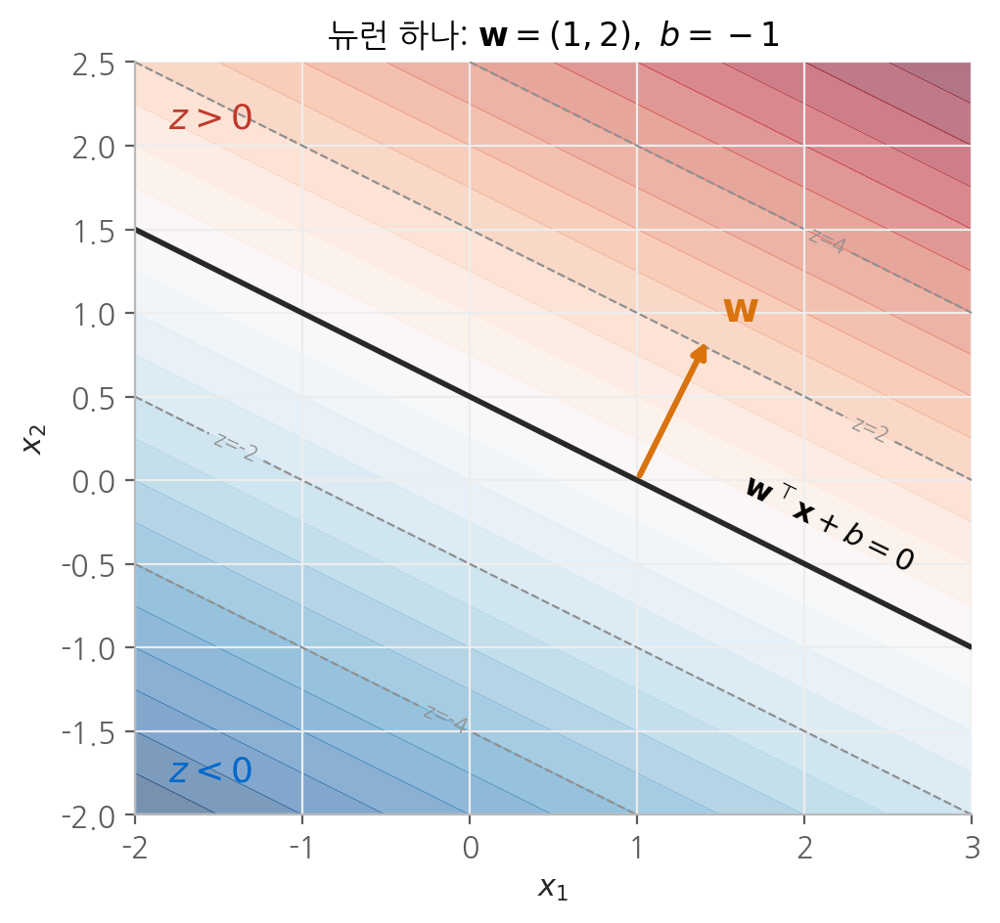
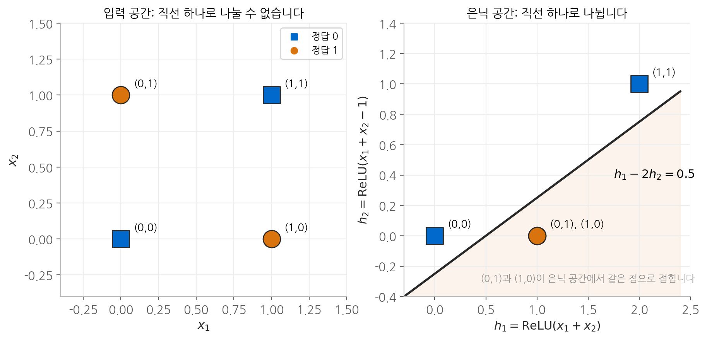
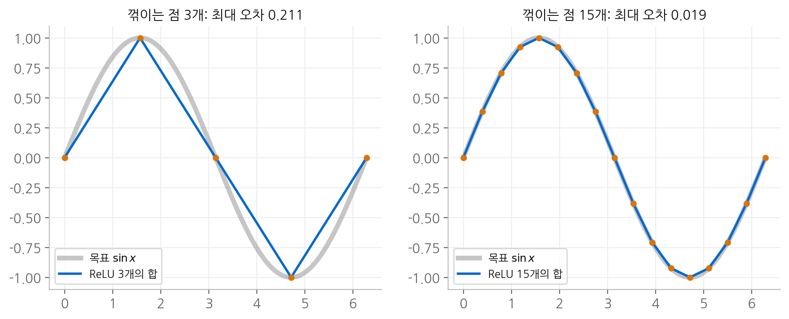

# 1. 다층 퍼셉트론

다층 퍼셉트론(MLP)은 입력층, 하나 이상의 은닉층, 출력층이 차례로 완전히 연결된
신경망입니다. 트랜스포머 블록 안의 피드포워드 층도 MLP이므로, LLM을 이해하는 출발점으로
삼기에 적합합니다. 이 장에서는 뉴런 하나의 계산을 기하학적으로 해석하고, 그것을 층과 배치로
확장한 뒤, 층을 쌓는 것이 왜 표현력을 늘리는지를 수학적으로 따라갑니다.

## 1. 뉴런 하나의 계산

### 정의

뉴런 하나는 입력의 가중합에 편향을 더하고, 그 결과를 활성화 함수에 통과시킵니다.

$$
z = \mathbf{w}^\top \mathbf{x} + b = \sum_{j=1}^{d} w_j x_j + b, \qquad a = \phi(z)
$$

$\mathbf{x} \in \mathbb{R}^d$ 는 입력, $\mathbf{w} \in \mathbb{R}^d$ 는 가중치, $b \in \mathbb{R}$ 는 편향입니다.
$z$ 를 **사전 활성화**, $a$ 를 **활성화**라고 부릅니다. 두 값을 구분해서 이름 붙여 두면,
역전파에서 어느 값에 대한 미분인지 헷갈리지 않습니다.

### 기하학적 의미: 초평면

$z = 0$ 을 만족하는 점들의 집합 $\{\mathbf{x} : \mathbf{w}^\top \mathbf{x} + b = 0\}$ 은
$d$ 차원 공간을 둘로 나누는 **초평면**입니다. 2차원이면 직선, 3차원이면 평면입니다.

이 초평면에 대해 두 가지 사실이 성립합니다.

**$\mathbf{w}$ 는 초평면에 수직입니다.** 초평면 위의 두 점 $\mathbf{x}_1, \mathbf{x}_2$ 를 잡으면
$\mathbf{w}^\top \mathbf{x}_1 + b = 0$, $\mathbf{w}^\top \mathbf{x}_2 + b = 0$ 이므로
두 식을 빼서 $\mathbf{w}^\top (\mathbf{x}_1 - \mathbf{x}_2) = 0$ 을 얻습니다.
초평면 안의 어떤 방향과도 내적이 0이므로 $\mathbf{w}$ 는 초평면의 법선 벡터입니다.

**$z$ 는 초평면까지의 부호 있는 거리에 비례합니다.** 점 $\mathbf{x}$ 에서 초평면까지의
부호 있는 거리는 다음과 같습니다.

$$
\text{dist}(\mathbf{x}) = \frac{\mathbf{w}^\top \mathbf{x} + b}{\lVert \mathbf{w} \rVert} = \frac{z}{\lVert \mathbf{w} \rVert}
$$

따라서 $z$ 의 부호는 점이 초평면의 어느 쪽에 있는지를, $z$ 의 크기는 얼마나 멀리 있는지를
나타냅니다. $\mathbf{w}$ 의 방향이 초평면의 **기울기**를, $\mathbf{w}$ 의 크기가 거리에 따라
$z$ 가 변하는 **가파름**을, $b$ 가 초평면의 **위치**를 정합니다.

<figure markdown>

<figcaption>
w = (1, 2), b = −1 인 뉴런입니다. 검은 직선이 z = 0 인 경계이고, 주황 화살표 w 는
경계에 수직이며 z 가 증가하는 쪽을 가리킵니다. 점선은 z 가 같은 등고선으로,
w 방향으로 갈수록 z 가 일정한 간격으로 커집니다.
</figcaption>
</figure>

활성화 함수는 이 부호 있는 거리를 변형합니다. 계단 함수를 쓰면 경계의 어느 쪽인지만 남고,
시그모이드를 쓰면 경계 근처에서 부드럽게 0에서 1로 넘어가며, ReLU를 쓰면 한쪽은 0으로
지우고 다른 쪽은 거리를 그대로 통과시킵니다.

## 2. 층: 뉴런을 묶으면 행렬 곱이 됩니다

같은 입력을 받는 뉴런 $k$ 개를 나란히 두면, 각 뉴런의 가중치 벡터를 행으로 쌓아
행렬 $\mathbf{W} \in \mathbb{R}^{k \times d}$ 를 만들 수 있습니다.

$$
\mathbf{W} = \begin{bmatrix} \mathbf{w}_1^\top \\ \vdots \\ \mathbf{w}_k^\top \end{bmatrix},
\qquad
\mathbf{z} = \mathbf{W}\mathbf{x} + \mathbf{b}
= \begin{bmatrix} \mathbf{w}_1^\top \mathbf{x} + b_1 \\ \vdots \\ \mathbf{w}_k^\top \mathbf{x} + b_k \end{bmatrix}
\in \mathbb{R}^k
$$

행렬 곱의 $i$ 번째 성분이 곧 $i$ 번째 뉴런의 사전 활성화입니다. 층 하나는
**$k$ 개의 초평면을 동시에 그어서, 입력 하나를 $k$ 개의 부호 있는 거리로 바꾸는 사상**으로
이해할 수 있습니다.

기하학적으로 보면 $\mathbf{W}$ 는 입력 공간을 $k$ 차원 공간으로 옮기는 선형 사상입니다.
$\mathbf{W}$ 의 특이값 분해 $\mathbf{W} = \mathbf{U}\boldsymbol{\Sigma}\mathbf{V}^\top$ 을 적용하면,
층의 선형 부분은 **회전($\mathbf{V}^\top$), 축별 늘이기와 줄이기($\boldsymbol{\Sigma}$), 다시 회전($\mathbf{U}$)**
의 세 단계로 분해되고, 편향이 이를 평행 이동합니다.

## 3. 배치: 표본을 행으로 쌓습니다

실제로는 입력 $N$ 개를 한꺼번에 처리합니다. 표본을 행으로 쌓은 행렬
$\mathbf{X} \in \mathbb{R}^{N \times d}$ 를 쓰면, 관례상 가중치를 전치한 형태로 적습니다.

$$
\mathbf{Z} = \mathbf{X}\mathbf{W}^\top + \mathbf{1}_N \mathbf{b}^\top \in \mathbb{R}^{N \times k},
\qquad
Z_{ni} = \mathbf{w}_i^\top \mathbf{x}_n + b_i
$$

이 장의 뒷부분과 이후 장에서는 표기를 단순하게 하려고 $\mathbf{W}$ 를 처음부터
$d \times k$ 로 정의해서 $\mathbf{Z} = \mathbf{X}\mathbf{W} + \mathbf{b}$ 로 쓰겠습니다.
두 표기는 전치 하나 차이이고 내용은 같습니다.

$\mathbf{1}_N \mathbf{b}^\top$ 은 같은 편향 벡터를 $N$ 개 행에 복제한 행렬입니다.
프로그래밍에서 **브로드캐스팅**이라 부르는 연산이 수학적으로는 이 외적입니다.
이 복제가 역전파에서 **합**으로 되돌아온다는 점은
[3. 그래디언트](03-gradients.md)에서 유도했습니다.

반복문 대신 행렬 곱 하나로 쓰는 이유는 표기의 간결함만이 아닙니다.
$N \times d$ 와 $d \times k$ 의 곱은 곱셈 $Ndk$ 번으로 이루어지는데, 이 연산은
서로 독립적인 곱셈과 덧셈의 묶음이라 병렬 하드웨어에서 한꺼번에 처리할 수 있습니다.

## 4. 2층 MLP의 순전파

은닉층 하나와 출력층 하나로 이루어진 분류 모델을 쓰면 다음과 같습니다.

$$
\begin{aligned}
\mathbf{Z}_1 &= \mathbf{X}\mathbf{W}_1 + \mathbf{b}_1 & &\in \mathbb{R}^{N \times h} & &\text{은닉층 사전 활성화} \\
\mathbf{H} &= \phi(\mathbf{Z}_1) & &\in \mathbb{R}^{N \times h} & &\text{은닉 표현} \\
\mathbf{Z}_2 &= \mathbf{H}\mathbf{W}_2 + \mathbf{b}_2 & &\in \mathbb{R}^{N \times c} & &\text{로짓} \\
\mathbf{P} &= \operatorname{softmax}(\mathbf{Z}_2) & &\in \mathbb{R}^{N \times c} & &\text{클래스별 확률}
\end{aligned}
$$

softmax는 행마다 적용되며, 각 행을 합이 1인 확률 분포로 바꿉니다.

$$
P_{ni} = \frac{e^{Z_{2,ni}}}{\sum_{j=1}^{c} e^{Z_{2,nj}}}, \qquad \sum_{i=1}^{c} P_{ni} = 1
$$

모든 성분이 양수이고 합이 1이므로 확률로 해석할 수 있습니다. softmax의 성질은
[2. 활성화 함수](02-activations.md)에서 자세히 다룹니다.

### 죽은 ReLU

활성화 함수로 ReLU $\phi(z) = \max(0, z)$ 를 쓰면, 은닉 뉴런 $i$ 가 어떤 입력에 대해
$Z_{1,ni} < 0$ 일 때 그 출력 $H_{ni}$ 는 정확히 0이 됩니다. 더 심각한 것은 그래디언트입니다.

$$
\frac{\partial H_{ni}}{\partial Z_{1,ni}} = \mathbb{1}[Z_{1,ni} > 0]
$$

만약 **모든** 학습 데이터에 대해 뉴런 $i$ 의 사전 활성화가 음수라면, 이 뉴런으로 흘러드는
그래디언트가 전부 0이 됩니다. 그러면 그 뉴런의 가중치 $\mathbf{W}_1[:, i]$ 와 편향 $b_{1,i}$ 는
어떤 데이터를 보아도 갱신되지 않고, 뉴런은 영원히 0만 출력합니다.
이를 **죽은 ReLU** 문제라고 부릅니다. 기하학적으로는 뉴런의 초평면이 모든 데이터의 바깥으로
밀려난 상태이며, 학습률이 커서 편향이 크게 음수 쪽으로 튀었을 때 자주 발생합니다.

또한 어떤 표본에서 은닉층 전체가 0이 되면 $\mathbf{Z}_2$ 의 그 행은 $\mathbf{b}_2$ 와 같아집니다.
출력층이 입력 정보를 전혀 보지 못하고 편향만으로 예측하는 상태가 됩니다.

## 5. 층을 쌓으면 무엇이 달라지는가

### XOR: 선형 경계 하나로는 풀 수 없는 문제

네 점 $(0,0), (0,1), (1,0), (1,1)$ 에 각각 정답 $0, 1, 1, 0$ 이 붙은 XOR 문제를 생각하겠습니다.
직선 하나로 두 클래스를 나눌 수 있는지 확인하려면, 어떤 $\mathbf{w}, b$ 에 대해
정답 1인 점에서는 $z > 0$, 정답 0인 점에서는 $z < 0$ 이어야 합니다.

$$
\begin{aligned}
(0,0) &: \quad b < 0 \\
(1,1) &: \quad w_1 + w_2 + b < 0 \\
(0,1) &: \quad w_2 + b > 0 \\
(1,0) &: \quad w_1 + b > 0
\end{aligned}
$$

아래 두 식을 더하면 $w_1 + w_2 + 2b > 0$ 이고, 위 두 식을 더하면 $w_1 + w_2 + 2b < 0$ 입니다.
같은 양이 양수이면서 음수일 수 없으므로 **어떤 직선으로도 XOR을 나눌 수 없습니다.**

### 은닉층은 공간을 접습니다

은닉 뉴런 두 개로 입력을 변환해 보겠습니다.

$$
h_1 = \operatorname{ReLU}(x_1 + x_2), \qquad h_2 = \operatorname{ReLU}(x_1 + x_2 - 1)
$$

네 점이 은닉 공간으로 옮겨지는 결과는 다음과 같습니다.

| 입력 $(x_1, x_2)$ | $h_1$ | $h_2$ | $h_1 - 2h_2$ | 정답 |
| --- | --- | --- | --- | --- |
| $(0, 0)$ | 0 | 0 | 0 | 0 |
| $(0, 1)$ | 1 | 0 | 1 | 1 |
| $(1, 0)$ | 1 | 0 | 1 | 1 |
| $(1, 1)$ | 2 | 1 | 0 | 0 |

$(0,1)$ 과 $(1,0)$ 이 은닉 공간에서 **같은 점 $(1, 0)$ 으로 합쳐졌습니다.** 이제 출력 뉴런
$y = h_1 - 2h_2$ 가 XOR과 정확히 일치합니다. 경계 $h_1 - 2h_2 = 0.5$ 는 은닉 공간의 직선이므로,
**입력 공간에서 불가능했던 선형 분리가 은닉 공간에서는 가능해졌습니다.**

<figure markdown>

<figcaption>
왼쪽의 입력 공간에서는 어떤 직선도 두 클래스를 나누지 못합니다. 오른쪽은 ReLU 은닉층 두 개를
통과한 뒤의 공간으로, 정답 1인 두 점이 하나로 접히면서 직선 하나로 나눌 수 있게 됩니다.
</figcaption>
</figure>

ReLU는 $z < 0$ 인 쪽을 0으로 눌러 버리므로, 공간을 초평면을 따라 **접는** 연산으로 볼 수 있습니다.
층을 쌓는다는 것은 이런 접기와 선형 변환을 반복해서, 마지막 선형 층이 풀 수 있는 모양으로
데이터를 재배치하는 과정입니다.

### ReLU의 합은 조각별 선형 함수입니다

은닉 뉴런 $h$ 개를 가진 한 층짜리 ReLU 신경망의 출력을 스칼라 입력 $x$ 에 대해 쓰면 다음과 같습니다.

$$
f(x) = c_0 + \sum_{i=1}^{h} u_i \operatorname{ReLU}(w_i x + b_i)
$$

각 항은 $x = -b_i / w_i$ 에서 한 번 꺾이는 함수이므로, 합은 **최대 $h$ 번 꺾이는 조각별 선형 함수**입니다.
반대로 꺾이는 점을 $t_1 < t_2 < \cdots$ 에 두고 구간별 기울기를 $s_0, s_1, \dots$ 로 원한다면,
다음과 같이 정확히 구성할 수 있습니다.

$$
f(x) = f(t_0) + s_0 (x - t_0) + \sum_{k \geq 1} (s_k - s_{k-1}) \operatorname{ReLU}(x - t_k)
$$

$\operatorname{ReLU}(x - t_k)$ 는 $x > t_k$ 부터 기울기를 1씩 더하므로, 계수 $s_k - s_{k-1}$ 이
정확히 그 지점에서의 **기울기 변화량**입니다.

<figure markdown>

<figcaption>
sin x 를 꺾이는 점에서 지나는 조각별 선형 함수로 근사했습니다. 꺾이는 점이 3개일 때
최대 오차는 0.211 이고, 15개로 늘리면 0.019 로 줄어듭니다.
</figcaption>
</figure>

매끄러운 함수를 조각별 선형 함수로 근사할 때, 구간 길이를 $\ell$ 이라 하면 오차는
$\frac{\ell^2}{8} \max |f''|$ 이하입니다. 구간 수를 $m$ 배로 늘리면 $\ell$ 이 $1/m$ 이 되어
오차의 상한이 $1/m^2$ 로 줄어듭니다.

위 그림에 대입해 보겠습니다. $\sin x$ 는 $\max|f''| = 1$ 입니다. 구간이 4개이면
$\ell = \pi/2$ 이므로 상한은 $0.308$ 이고 실제 오차는 $0.211$ 입니다. 구간이 16개이면
$\ell = \pi/8$ 이므로 상한은 $0.0193$ 이고 실제 오차는 $0.0188$ 입니다.
구간이 촘촘해질수록 상한이 실제 오차에 거의 붙는데, 구간이 좁을수록 각 구간 안의 곡률이
일정하다는 근사가 정확해지기 때문입니다.

이것이 **은닉층 하나에 뉴런이 충분히 많으면 연속 함수를 원하는 정밀도로 근사할 수 있다**는
보편 근사 정리의 직관입니다. 다만 이 정리는 근사가 **존재한다**는 것을 말할 뿐이며,
필요한 뉴런 수가 얼마인지, 경사 하강법으로 그 해를 찾을 수 있는지는 말해 주지 않습니다.
실제로는 폭을 무한정 늘리기보다 층을 깊게 쌓는 편이 같은 표현력을 훨씬 적은 파라미터로 얻습니다.
접기를 $L$ 번 반복하면 조각의 수가 층마다 곱으로 늘어날 수 있기 때문입니다.

## 6. 파라미터 수

입력 $d_{\text{in}}$, 출력 $d_{\text{out}}$ 인 층 하나의 파라미터 수는 다음과 같습니다.

$$
\underbrace{d_{\text{in}} \cdot d_{\text{out}}}_{\text{가중치}} + \underbrace{d_{\text{out}}}_{\text{편향}}
$$

입력 3, 은닉 4, 출력 2인 2층 MLP라면 $3 \cdot 4 + 4 + 4 \cdot 2 + 2 = 26$ 개입니다.

이 계산은 모델 크기를 어림잡을 때 유용합니다. $d_{\text{model}} = 4096$, $d_{\text{ff}} = 11008$ 인
트랜스포머 블록의 피드포워드 층에서 행렬 하나는 $4096 \times 11008 \approx 4{,}509$ 만 개의
파라미터를 갖습니다. 게이트가 있는 SwiGLU 구조는 이런 행렬을 3개 쓰므로 블록 하나의
피드포워드 층만으로 약 1억 3,500만 개입니다.

같은 행렬의 편향은 $11{,}008$ 개로, 가중치의 약 $0.024\%$ 에 불과합니다.
최근 LLM들이 편향을 아예 쓰지 않는 선택을 해도 모델 크기에는 사실상 영향이 없는 이유입니다.

## 정리

| 개념 | 수식 | 해석 |
| --- | --- | --- |
| 뉴런 | $z = \mathbf{w}^\top \mathbf{x} + b$ | 초평면까지의 부호 있는 거리에 비례 |
| 층 | $\mathbf{z} = \mathbf{W}\mathbf{x} + \mathbf{b}$ | 초평면 $k$ 개를 동시에 적용하는 선형 사상 |
| 배치 | $\mathbf{Z} = \mathbf{X}\mathbf{W} + \mathbf{1}\mathbf{b}^\top$ | 표본을 행으로 쌓은 행렬 곱 |
| ReLU 은닉층 | $\max(0, \mathbf{Z})$ | 초평면을 따라 공간을 접는 연산 |
| 파라미터 수 | $d_{\text{in}} d_{\text{out}} + d_{\text{out}}$ | 가중치가 거의 전부를 차지 |

## 다음 장

은닉층이 공간을 접을 수 있었던 것은 ReLU라는 비선형 함수 덕분이었습니다.
[다음 장](02-activations.md)에서는 비선형성이 왜 반드시 필요한지 증명하고,
여러 활성화 함수가 그래디언트에 어떤 영향을 주는지 비교합니다.
