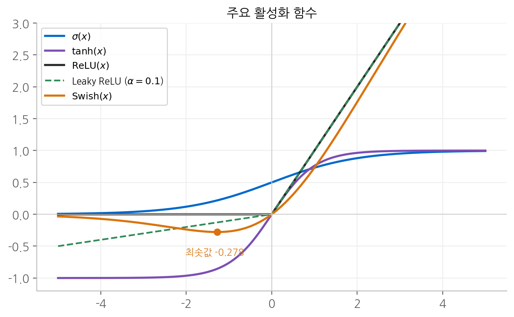
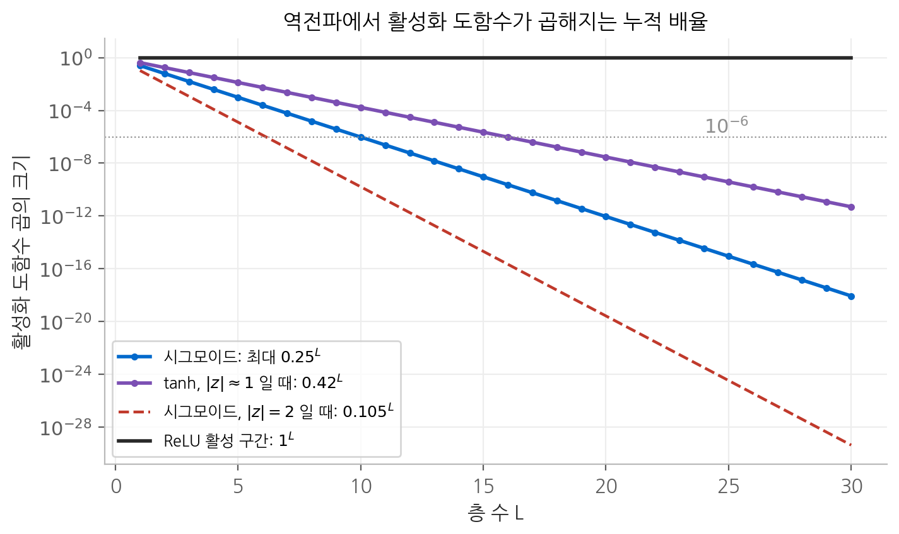
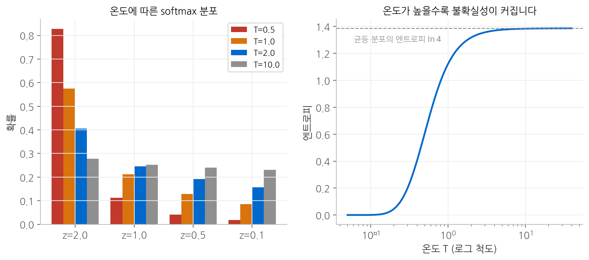
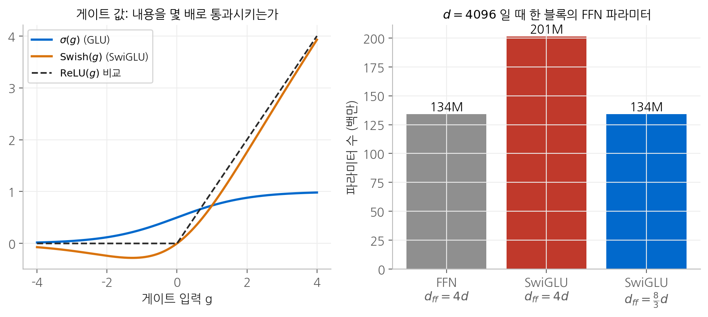

# 2. 활성화 함수

활성화 함수는 층과 층 사이에 끼워 넣는 비선형 함수입니다. 이 장에서는 먼저 비선형성이
없으면 층을 아무리 쌓아도 소용이 없다는 것을 증명하고, 주요 활성화 함수를 그래디언트의
관점에서 비교합니다. 이어서 출력층에서 쓰는 softmax의 수학적 성질과, 최근 LLM이 피드포워드
층에 쓰는 GLU 계열을 다룹니다.

## 1. 비선형성이 반드시 필요한 이유

활성화 함수 없이 선형 층 두 개를 쌓으면 다음과 같습니다.

$$
\mathbf{W}_2(\mathbf{W}_1 \mathbf{x} + \mathbf{b}_1) + \mathbf{b}_2
= \underbrace{(\mathbf{W}_2 \mathbf{W}_1)}_{\tilde{\mathbf{W}}} \mathbf{x} + \underbrace{(\mathbf{W}_2 \mathbf{b}_1 + \mathbf{b}_2)}_{\tilde{\mathbf{b}}}
$$

결과가 다시 $\tilde{\mathbf{W}} \mathbf{x} + \tilde{\mathbf{b}}$ 꼴의 선형 층 하나입니다.
귀납적으로 $L$ 개를 쌓아도 마찬가지이므로, **선형 층만으로 이루어진 신경망은 깊이와 무관하게
선형 모델 하나와 표현력이 같습니다.** [1장](01-mlp.md)의 XOR처럼 선형 경계로 풀 수 없는 문제는
층을 몇 개를 쌓아도 풀 수 없습니다.

오히려 손해가 생기기도 합니다. $\mathbf{W}_1 \in \mathbb{R}^{k \times d}$ 에서 $k < d$ 이면
$\operatorname{rank}(\mathbf{W}_2 \mathbf{W}_1) \leq k$ 이므로, 중간 차원이 좁은 선형 층을 쌓는 것은
표현력을 **줄이기만** 합니다. 선형 층 사이에 비선형 함수를 넣어야 비로소 합성이 한 층으로
붕괴하지 않고, 층을 쌓는 의미가 생깁니다.

## 2. 주요 활성화 함수

| 함수 | 정의 | 도함수 | 치역 |
| --- | --- | --- | --- |
| 시그모이드 | $\sigma(x) = \dfrac{1}{1 + e^{-x}}$ | $\sigma(x)(1 - \sigma(x))$ | $(0, 1)$ |
| 쌍곡탄젠트 | $\tanh(x) = \dfrac{e^x - e^{-x}}{e^x + e^{-x}}$ | $1 - \tanh^2(x)$ | $(-1, 1)$ |
| ReLU | $\max(0, x)$ | $\mathbb{1}[x > 0]$ | $[0, \infty)$ |
| Leaky ReLU | $\max(\alpha x, x)$ | $1$ 또는 $\alpha$ | $(-\infty, \infty)$ |
| Swish | $x \cdot \sigma(x)$ | $\sigma(x) + \mathrm{Swish}(x)(1 - \sigma(x))$ | $[-0.278, \infty)$ |

도함수의 유도 과정은 [3. 그래디언트](03-gradients.md)에 정리했습니다.

<figure markdown>

<figcaption>
시그모이드와 tanh 는 양 끝에서 평평해지고, ReLU 는 음수 쪽을 0으로 자릅니다.
Leaky ReLU 는 음수 쪽에 작은 기울기를 남기고, Swish 는 x ≈ −1.28 에서
최솟값 −0.278 을 갖는 매끄러운 곡선입니다.
</figcaption>
</figure>

### 시그모이드와 tanh는 사실상 같은 함수입니다

$\sigma(2x)$ 에 2를 곱하고 1을 빼면 다음과 같습니다.

$$
2\sigma(2x) - 1 = \frac{2}{1 + e^{-2x}} - 1 = \frac{1 - e^{-2x}}{1 + e^{-2x}} = \frac{e^{x} - e^{-x}}{e^{x} + e^{-x}} = \tanh(x)
$$

tanh는 시그모이드를 가로로 절반 압축하고 세로로 2배 늘린 뒤 아래로 1 내린 것입니다.
모양은 같지만 두 가지가 다릅니다. **출력이 0을 중심으로 대칭**이라 다음 층의 입력이 평균적으로
0 근처에 모이고, **원점에서의 기울기가 1**로 시그모이드의 0.25보다 4배 큽니다.

## 3. 포화와 기울기 소실

### 포화

시그모이드의 도함수 $\sigma(x)(1 - \sigma(x))$ 는 $|x|$ 가 커지면 빠르게 0으로 갑니다.
$x \to \infty$ 에서의 거동을 보면 다음과 같습니다.

$$
\sigma'(x) = \frac{e^{-x}}{(1 + e^{-x})^2} \approx e^{-x} \qquad (x \gg 1)
$$

**기울기가 지수적으로 사라집니다.** $x = 5$ 이면 약 $0.0066$, $x = 10$ 이면 약 $4.5 \times 10^{-5}$ 입니다.
tanh도 $1 - \tanh^2(x) \approx 4e^{-2x}$ 로 같은 방식으로 사라집니다.
입력이 이 평평한 구간에 들어간 뉴런을 **포화되었다**고 말합니다. 포화된 뉴런은 역전파로
거의 어떤 신호도 받지 못하므로 학습이 멈춥니다.

### 깊이에 따라 곱해지는 도함수

$L$ 개의 층을 거친 그래디언트는 연쇄 법칙에 따라 층마다의 야코비안을 곱한 것입니다.
한 뉴런이 층마다 하나씩 이어진 가장 단순한 경우를 생각하면 다음과 같습니다.

$$
\frac{\partial a_L}{\partial a_0} = \prod_{\ell=1}^{L} \phi'(z_\ell)\, w_\ell
$$

활성화 도함수만 떼어 보면, 시그모이드는 $\phi'(z) \leq 1/4$ 이므로 그 곱은 최대 $(1/4)^L$ 입니다.
$L = 10$ 이면 $10^{-6}$ 수준입니다. 가중치를 키워서 보상하려 해도, $|w|$ 가 커지면 $z$ 도 커져
뉴런이 포화되므로 $\phi'$ 가 더 작아집니다. 이 줄다리기에서 시그모이드는 이기기 어렵습니다.

<figure markdown>

<figcaption>
활성화 도함수를 층 수만큼 곱한 값입니다. 시그모이드는 가장 좋은 경우에도 0.25ᴸ 로 줄고,
입력이 |z| = 2 근처에만 있어도 층마다 0.105 배가 됩니다. tanh 는 |z| ≈ 1 에서 층마다 0.42 배입니다.
ReLU 는 활성 구간에서 도함수가 정확히 1이므로 줄어들지 않습니다.
</figcaption>
</figure>

### ReLU가 해결한 것과 남긴 것

ReLU의 도함수는 $\mathbb{1}[x > 0]$ 이므로 활성 구간에서는 **정확히 1**입니다. 곱이 줄어들지 않으므로
깊은 신경망에서도 그래디언트가 전달됩니다. 계산도 비교 한 번으로 끝납니다.

대신 음수 구간에서는 도함수가 정확히 0입니다. 뉴런이 모든 입력에 대해 음수 쪽에 머물면
[1장](01-mlp.md)에서 본 죽은 ReLU가 됩니다. Leaky ReLU는 음수 쪽 기울기를 $\alpha$ (보통 $0.01$)로
남겨서 이 문제를 완화합니다. 도함수가 $\{\alpha, 1\}$ 중 하나이므로 절대로 0이 되지 않습니다.

$x = 0$ 에서 ReLU는 미분할 수 없습니다. 왼쪽 도함수는 0, 오른쪽 도함수는 1입니다.
실제 구현에서는 관례적으로 0이나 1 중 하나를 택하고, 연속 값을 가진 입력이 정확히 0이 될
확률은 사실상 0이므로 보통 문제가 되지 않습니다. 다만 이 점이 문제가 되는 상황이
[4. 역전파](04-backprop.md)의 그래디언트 검증에서 실제로 나타납니다.

### Swish: 매끄럽고 단조롭지 않은 함수

$\mathrm{Swish}(x) = x\,\sigma(x)$ 는 양수 쪽에서는 $\sigma(x) \to 1$ 이므로 $x$ 에 가까워져 ReLU처럼 동작하고,
음수 쪽에서는 $\sigma(x) \to 0$ 이 $x$ 보다 빨리 줄어들어 0으로 수렴합니다.
두 거동 사이에서 **감소하는 구간**이 생깁니다. 도함수를 0으로 두면 다음 방정식을 얻습니다.

$$
\sigma(x)\big(1 + x(1 - \sigma(x))\big) = 0 \quad \Longleftrightarrow \quad 1 + x(1 - \sigma(x)) = 0
$$

이를 수치적으로 풀면 $x \approx -1.278$ 이고, 이때 최솟값은 $\mathrm{Swish}(-1.278) \approx -0.278$ 입니다.
Swish는 모든 점에서 미분 가능하므로 ReLU처럼 기울기가 불연속적으로 바뀌지 않고,
음수 입력에도 작은 그래디언트가 흐릅니다.

## 4. softmax

### 정의와 기본 성질

softmax는 로짓 벡터 $\mathbf{z} \in \mathbb{R}^K$ 를 확률 분포로 바꿉니다.

$$
\operatorname{softmax}(\mathbf{z})_i = \frac{e^{z_i}}{\sum_{j=1}^{K} e^{z_j}}
$$

지수 함수가 항상 양수이므로 모든 출력이 양수이고, 분모가 분자들의 합이므로 출력의 합이 1입니다.
또한 지수 함수가 단조 증가이므로 **로짓의 순서가 확률의 순서로 그대로 보존됩니다.**

### 상수를 더해도 결과가 같습니다

모든 로짓에 같은 상수 $c$ 를 더해 보겠습니다.

$$
\frac{e^{z_i + c}}{\sum_j e^{z_j + c}} = \frac{e^{c}\, e^{z_i}}{e^{c} \sum_j e^{z_j}} = \frac{e^{z_i}}{\sum_j e^{z_j}}
$$

$e^c$ 가 분자와 분모에서 약분되므로 결과가 변하지 않습니다. softmax는 **로짓의 절대값이 아니라
로짓 사이의 차이에만 반응합니다.** 확률 $K$ 개의 합이 1이라는 제약 때문에 자유도가 $K - 1$ 이라는
사실과 같은 말입니다.

### 수치 안정성

64비트 부동소수점이 표현할 수 있는 가장 큰 수는 약 $1.8 \times 10^{308}$ 이므로,
$e^{z}$ 는 $z > 709.78$ 이면 무한대가 됩니다. 로짓이 $[1000, 1001, 1002]$ 이면 분자와 분모가
모두 무한대가 되어 $\infty / \infty$, 즉 정의되지 않은 값이 나옵니다.

위의 상수 불변성이 해결책을 줍니다. $c = -\max_j z_j$ 를 더하면 결과는 같고,
가장 큰 지수가 $e^0 = 1$ 이 되어 넘침이 사라집니다.

$$
\operatorname{softmax}(\mathbf{z})_i = \frac{e^{z_i - m}}{\sum_j e^{z_j - m}}, \qquad m = \max_j z_j
$$

분모에는 최소한 1이 들어 있으므로 0으로 나누는 일도 생기지 않습니다.
$[1000, 1001, 1002]$ 는 $[-2, -1, 0]$ 으로 바뀌고, 그 결과 $(0.090, 0.245, 0.665)$ 는
$[1, 2, 3]$ 의 softmax와 정확히 같습니다. 두 입력의 차이가 같기 때문입니다.

### 온도

로짓을 온도 $T > 0$ 로 나눈 뒤 softmax를 적용합니다.

$$
p_i(T) = \frac{e^{z_i / T}}{\sum_j e^{z_j / T}}
$$

두 극한을 보면 온도의 역할이 분명해집니다.

**$T \to 0$.** 최댓값을 갖는 로짓을 $z_{i^*}$ 라 하고 분자와 분모를 $e^{z_{i^*}/T}$ 로 나누면 다음과 같습니다.

$$
p_{i^*}(T) = \frac{1}{1 + \sum_{j \neq i^*} e^{(z_j - z_{i^*})/T}}
$$

$z_j - z_{i^*} < 0$ 이므로 $T \to 0$ 에서 각 지수 항이 0으로 가고 $p_{i^*} \to 1$ 입니다.
분포가 최댓값 하나에 몰린 원핫, 즉 $\arg\max$ 가 됩니다.

**$T \to \infty$.** 모든 $z_i / T \to 0$ 이므로 각 항이 $e^0 = 1$ 에 가까워지고
$p_i \to 1/K$ 인 균등 분포가 됩니다.

온도는 이 두 극단 사이를 연속적으로 잇습니다. 로짓 $(2, 1, 0.5, 0.1)$ 에 적용하면 다음과 같습니다.

| $T$ | $p_1$ | $p_2$ | $p_3$ | $p_4$ |
| --- | --- | --- | --- | --- |
| 0.5 | 0.828 | 0.112 | 0.041 | 0.019 |
| 1 | 0.575 | 0.211 | 0.128 | 0.086 |
| 2 | 0.406 | 0.246 | 0.192 | 0.157 |
| 10 | 0.278 | 0.252 | 0.240 | 0.230 |

<figure markdown>

<figcaption>
왼쪽은 온도별 분포이고, 오른쪽은 온도에 따른 분포의 엔트로피입니다. 온도가 낮으면 가장 큰
로짓에 확률이 몰리고, 높아지면 엔트로피가 균등 분포의 값 ln 4 에 가까워집니다.
</figcaption>
</figure>

LLM이 다음 토큰을 샘플링할 때 쓰는 온도가 바로 이 $T$ 입니다. 온도를 낮추면 가장 그럴듯한
토큰만 고르는 보수적인 생성이 되고, 높이면 확률이 낮은 토큰도 선택되어 다양하지만
엉뚱한 생성이 됩니다.

## 5. GLU와 SwiGLU

### 게이트의 아이디어

GLU(게이트 선형 유닛)는 입력을 두 갈래로 선형 변환합니다. 한 갈래는 **내용**이 되고,
다른 갈래는 그 내용을 얼마나 통과시킬지 정하는 **게이트**가 됩니다.

$$
\mathrm{GLU}(\mathbf{x}) = (\mathbf{x}\mathbf{W}) \odot \sigma(\mathbf{x}\mathbf{V}),
\qquad
\mathrm{SwiGLU}(\mathbf{x}) = (\mathbf{x}\mathbf{W}) \odot \mathrm{Swish}(\mathbf{x}\mathbf{V})
$$

$\odot$ 은 원소별 곱입니다. GLU에서 게이트 값 $\sigma(\cdot)$ 은 0과 1 사이이므로 각 차원을 **연속적인
비율로** 막거나 열어 둡니다. ReLU가 "음수면 전부 버린다"는 이분법이라면, 게이트는 차원마다
통과량을 조절하고, 그 조절 자체가 입력에 따라 달라집니다.

<figure markdown>

<figcaption>
왼쪽은 게이트 입력에 따른 게이트 값입니다. 시그모이드 게이트는 0에서 1 사이의 비율이고,
Swish 게이트는 양수 쪽에서 1을 넘어 증폭도 합니다. 오른쪽은 d = 4096 일 때 피드포워드 층의
파라미터 수입니다.
</figcaption>
</figure>

### 게이트는 두 갈래 모두에 그래디언트를 보냅니다

$\mathbf{y} = \mathbf{a} \odot \sigma(\mathbf{g})$ 에서 $\mathbf{a} = \mathbf{x}\mathbf{W}$, $\mathbf{g} = \mathbf{x}\mathbf{V}$ 라 하면,
곱의 미분법에 따라 성분별로 다음이 성립합니다.

$$
\frac{\partial y_i}{\partial a_i} = \sigma(g_i),
\qquad
\frac{\partial y_i}{\partial g_i} = a_i\, \sigma(g_i)\big(1 - \sigma(g_i)\big)
$$

내용 쪽 그래디언트는 게이트 값만큼 통과하고, 게이트 쪽 그래디언트는 내용의 크기에 비례합니다.
게이트가 닫혀 있어도($\sigma(g_i) \approx 0$) 게이트 쪽으로는 $a_i \sigma'(g_i)$ 가 흐르므로,
**"이 차원을 열었어야 했다"는 신호를 게이트가 받을 수 있습니다.** ReLU에서 음수 쪽으로 밀린
뉴런이 아무 신호도 받지 못하던 것과 대비됩니다.

### 파라미터 수 맞추기

기존 피드포워드 층은 행렬 2개($d \times d_{\text{ff}}$, $d_{\text{ff}} \times d$)를 쓰고, 보통
$d_{\text{ff}} = 4d$ 로 잡으므로 파라미터 수는 다음과 같습니다.

$$
2 \cdot d \cdot 4d = 8d^2
$$

SwiGLU는 게이트 행렬 $\mathbf{V}$ 가 하나 더 있어서 행렬이 3개입니다. 같은 $d_{\text{ff}} = 4d$ 를 쓰면
$12d^2$ 로 1.5배가 됩니다. 파라미터 수를 맞추려면 다음 식을 풉니다.

$$
3 \cdot d \cdot d_{\text{ff}}' = 8d^2 \quad \Longrightarrow \quad d_{\text{ff}}' = \frac{8}{3} d
$$

$d = 4096$ 이면 $d_{\text{ff}}' \approx 10{,}923$ 이고, 실제 Llama 계열이 쓰는 $11{,}008$ 은 이 값을
하드웨어에 유리한 256의 배수로 올린 것입니다. 이때 세 구조의 파라미터 수는 각각
약 1억 3,400만, 2억 100만, 1억 3,400만 개가 됩니다.

## 정리

| 함수 | 도함수의 최댓값 | 강점 | 약점 |
| --- | --- | --- | --- |
| 시그모이드 | 0.25 | 확률로 해석 가능 | 깊이에 따라 그래디언트가 지수적으로 소실 |
| tanh | 1 | 0 중심 출력 | 양 끝에서 포화 |
| ReLU | 1 (활성 구간) | 소실 없음, 계산이 간단 | 음수 구간 도함수가 0, 죽은 뉴런 |
| Leaky ReLU | 1 | 도함수가 0이 되지 않음 | $x=0$ 에서 미분 불가 |
| Swish | 약 1.10 | 매끄럽고 음수에도 그래디언트 | 계산이 조금 더 비쌈 |
| softmax | | 로짓을 확률로, 차이에만 반응 | 최댓값을 빼지 않으면 넘침 |
| SwiGLU | | 차원별로 통과량을 입력에 따라 조절 | 행렬이 하나 더 필요 |

## 다음 장

활성화 함수의 도함수가 깊이에 따라 곱해진다는 것을 연쇄 법칙으로 설명했습니다.
[다음 장](03-gradients.md)에서는 미분, 그래디언트, 야코비안, 헤시안을 정식으로 정의하고
연쇄 법칙으로 신경망 한 층의 그래디언트를 끝까지 유도합니다.
