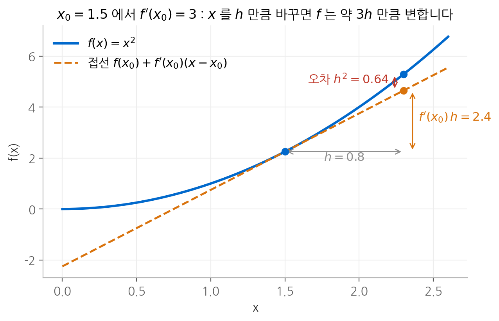
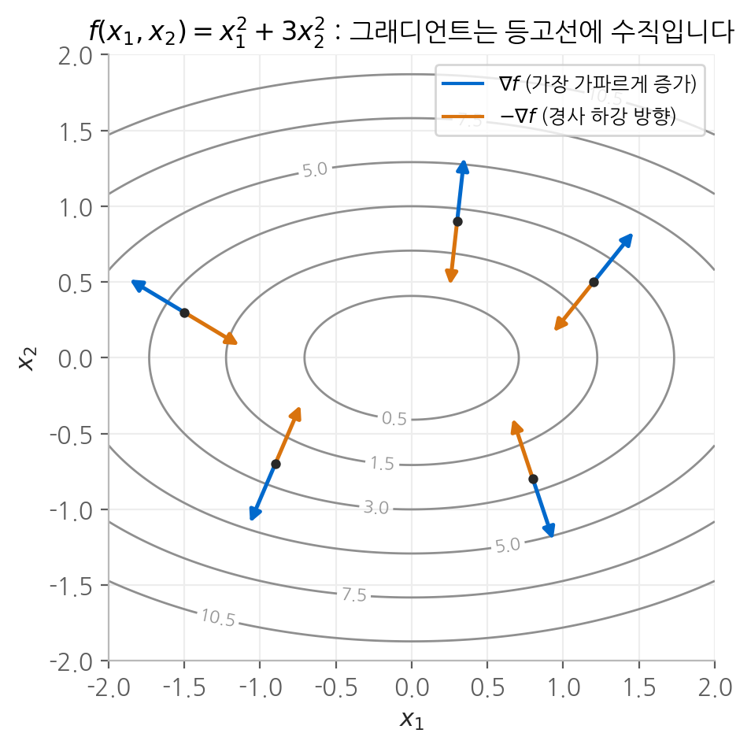
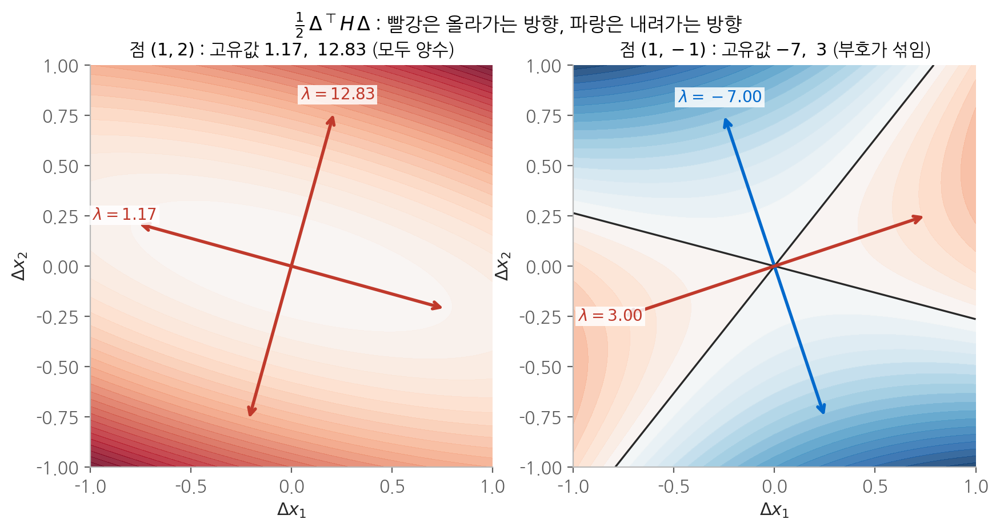
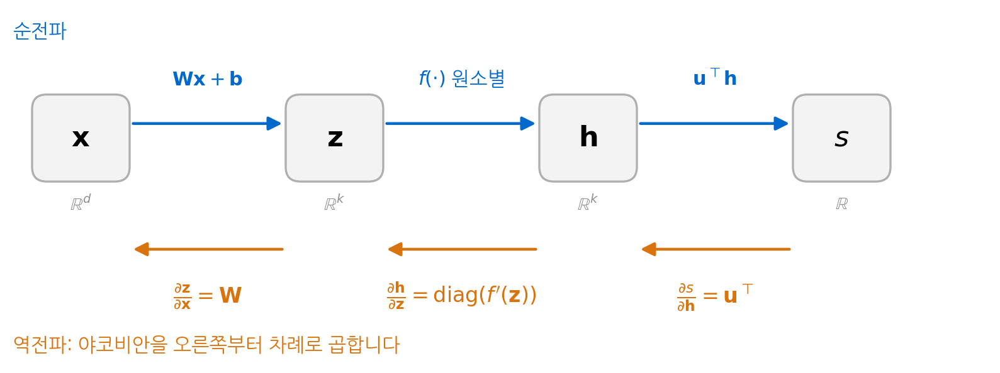
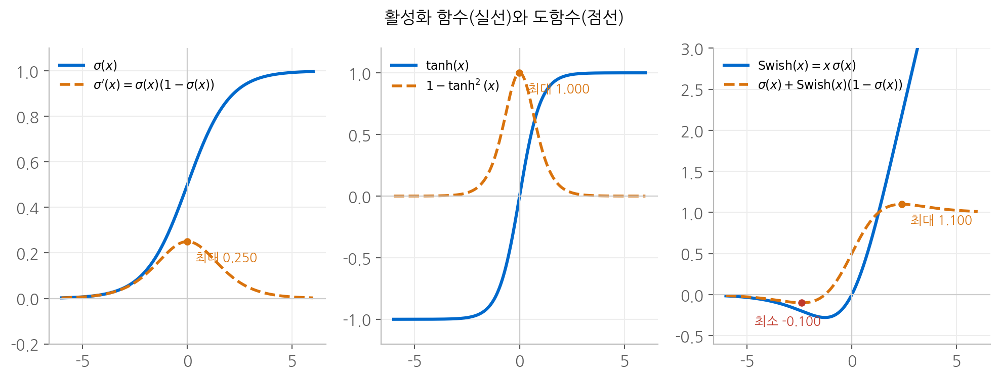
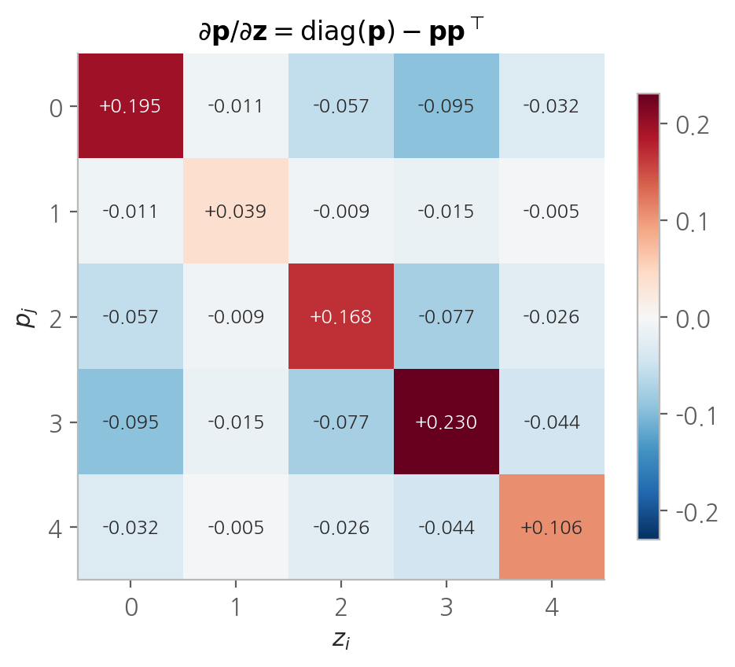
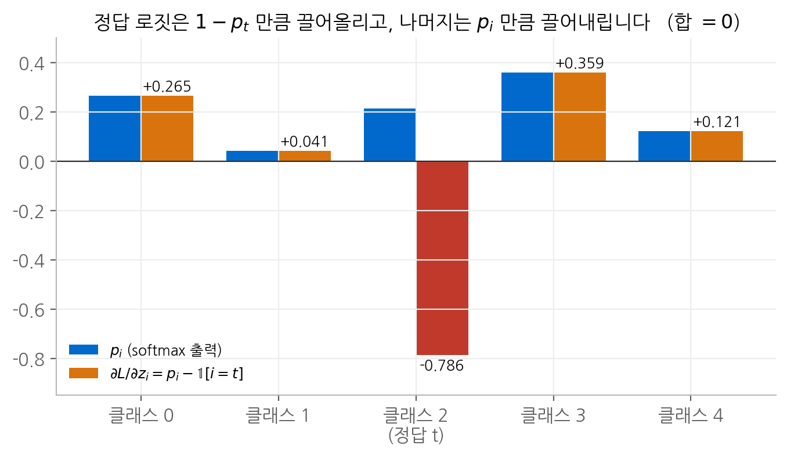

# 3. 그래디언트

신경망 학습은 결국 **"파라미터를 어느 방향으로 얼마나 바꾸면 손실이 줄어드는가"** 라는
질문에 답하는 일입니다. 이 장에서는 그 답을 주는 도구인 미분, 그래디언트, 야코비안,
헤시안을 정의하고, 연쇄 법칙으로 신경망 한 층의 그래디언트를 끝까지 유도합니다.
마지막으로 언어 모델의 출력층에서 쓰는 softmax와 교차 엔트로피의 그래디언트를
단계별로 계산합니다.

## 1. 미분은 민감도입니다

### 정의

한 변수 함수 $f$ 의 도함수는 다음 극한으로 정의합니다.

$$
\frac{df}{dx} = \lim_{h \to 0} \frac{f(x+h) - f(x)}{h}
$$

이 식을 계산 규칙으로 외우기보다 **의미**로 읽는 편이 훨씬 쓸모가 있습니다.
극한 기호를 떼고 양변에 $h$ 를 곱하면 다음 근사식이 됩니다.

$$
f(x + h) \approx f(x) + \frac{df}{dx}\, h
$$

즉 도함수는 **입력을 조금 바꿨을 때 출력이 몇 배로 반응하는지**를 나타내는 계수입니다.
$\partial f / \partial x = 3$ 이라면 $x$ 를 작은 양 $h$ 만큼 바꿀 때 $f$ 는 약 $3h$ 만큼 변합니다.
신경망에서 이 계수가 크다는 것은 그 파라미터가 손실에 큰 영향을 준다는 뜻이고,
0에 가깝다는 것은 그 파라미터를 바꿔도 손실이 거의 변하지 않는다는 뜻입니다.

<figure markdown>

<figcaption>
f(x) = x² 는 x₀ = 1.5 에서 기울기가 3입니다. x 를 0.8 만큼 움직이면 접선은 2.4 만큼의
변화를 예측하고, 실제 변화는 3.04 입니다. 차이 0.64 는 정확히 h² 입니다.
</figcaption>
</figure>

### 근사의 오차는 어디서 오는가

위 그림의 오차가 정확히 $h^2$ 인 이유를 계산으로 확인해 두겠습니다.

$$
f(x_0 + h) = (x_0 + h)^2 = x_0^2 + \underbrace{2x_0}_{f'(x_0)}\, h + h^2
$$

앞의 두 항이 선형 근사이고, 남는 $h^2$ 가 오차입니다. 일반적인 함수에서는
테일러 전개가 같은 구조를 보여 줍니다.

$$
f(x + h) = f(x) + f'(x)\, h + \frac{1}{2} f''(x)\, h^2 + O(h^3)
$$

두 가지를 읽어 낼 수 있습니다.

- **오차는 $h^2$ 에 비례합니다.** $h$ 를 절반으로 줄이면 오차는 4분의 1로 줄어듭니다.
  그래디언트가 "아주 작은 이동"에 대해서만 믿을 만한 정보라는 뜻이며,
  학습률을 너무 크게 잡으면 안 되는 근본적인 이유입니다.
- **오차의 크기는 2차 도함수 $f''(x)$ 가 정합니다.** 곡률이 큰 곳일수록 선형 근사가
  빨리 빗나갑니다. 이 곡률을 다변수로 확장한 것이 뒤에서 다룰 헤시안입니다.

### 중앙 차분이 더 정확한 이유

미분을 수치로 근사할 때는 한쪽 차분 대신 중앙 차분을 씁니다.
테일러 전개를 $+h$ 와 $-h$ 에 대해 쓰고 빼 보면 이유가 드러납니다.

$$
\begin{aligned}
f(x + h) &= f(x) + f'(x)\,h + \tfrac{1}{2} f''(x)\,h^2 + \tfrac{1}{6} f'''(x)\,h^3 + \cdots \\
f(x - h) &= f(x) - f'(x)\,h + \tfrac{1}{2} f''(x)\,h^2 - \tfrac{1}{6} f'''(x)\,h^3 + \cdots
\end{aligned}
$$

$$
\frac{f(x+h) - f(x-h)}{2h} = f'(x) + \frac{1}{6} f'''(x)\, h^2 + \cdots
$$

짝수 차수 항이 서로 상쇄되어 오차가 $O(h^2)$ 가 됩니다. 한쪽 차분의 오차는
$\frac{1}{2}f''(x)h$ 로 $O(h)$ 이므로, 같은 $h$ 에서 중앙 차분이 훨씬 정확합니다.
이 성질 덕분에 손으로 유도한 그래디언트를 수치로 검증할 수 있습니다.

## 2. 편미분과 그래디언트

### 편미분

입력이 여러 개인 함수 $f(x_1, \dots, x_n)$ 에서, 다른 변수는 고정하고 $x_i$ 하나만
움직일 때의 민감도가 편미분 $\partial f / \partial x_i$ 입니다. 계산 방법은
한 변수 미분과 같고, 나머지 변수를 상수로 취급하기만 하면 됩니다.

예를 들어 $g(x, y) = x^2 + 3xy + y^3$ 의 편미분은 다음과 같습니다.

$$
\frac{\partial g}{\partial x} = 2x + 3y, \qquad \frac{\partial g}{\partial y} = 3x + 3y^2
$$

### 그래디언트

편미분을 모두 모아 벡터로 만든 것이 그래디언트입니다.

$$
\nabla f = \begin{bmatrix} \dfrac{\partial f}{\partial x_1} & \dfrac{\partial f}{\partial x_2} & \cdots & \dfrac{\partial f}{\partial x_n} \end{bmatrix}^\top
$$

위의 $g$ 에서 점 $(1, 2)$ 의 그래디언트는 $\nabla g = (2 + 6,\ 3 + 12) = (8, 15)$ 입니다.

한 변수의 선형 근사도 그대로 확장됩니다. 입력을 벡터 $\Delta$ 만큼 움직이면
출력의 변화는 그래디언트와 이동 벡터의 내적으로 근사됩니다.

$$
f(\mathbf{x} + \Delta) \approx f(\mathbf{x}) + \nabla f(\mathbf{x})^\top \Delta
$$

### 그래디언트는 가장 가파르게 올라가는 방향입니다

길이가 1인 방향 $\mathbf{v}$ 로 조금 움직였을 때 $f$ 가 변하는 비율을
방향 도함수라고 합니다. 위 근사식에 $\Delta = h\mathbf{v}$ 를 넣으면 다음과 같습니다.

$$
D_{\mathbf{v}} f = \nabla f^\top \mathbf{v} = \lVert \nabla f \rVert \, \lVert \mathbf{v} \rVert \cos\theta = \lVert \nabla f \rVert \cos\theta
$$

$\theta$ 는 $\nabla f$ 와 $\mathbf{v}$ 사이의 각도입니다. 이 값은 $\cos\theta = 1$,
즉 $\mathbf{v}$ 가 그래디언트와 같은 방향일 때 가장 크고, 반대 방향일 때 가장 작습니다.
여기서 세 가지 사실이 한꺼번에 나옵니다.

1. **그래디언트 방향이 함수값이 가장 빠르게 증가하는 방향입니다.**
2. **그 증가율은 $\lVert \nabla f \rVert$ 입니다.**
3. **$\cos\theta = 0$ 인 방향, 즉 그래디언트에 수직인 방향으로는 함수값이 변하지 않습니다.**
   함수값이 같은 점들을 이은 등고선이 그래디언트에 수직인 이유입니다.

경사 하강법이 $-\nabla f$ 방향으로 움직이는 근거가 첫 번째 사실입니다.

<figure markdown>

<figcaption>
f = x₁² + 3x₂² 의 등고선과 여러 점에서의 그래디언트입니다. 파란 화살표(∇f)는 항상
등고선에 수직이고, 주황 화살표(−∇f)는 가장 빠르게 내려가는 방향입니다.
x₂ 축의 계수가 3배라서 화살표가 x₂ 방향으로 기울어 있습니다.
</figcaption>
</figure>

## 3. 야코비안

### 정의

출력이 $m$ 개이고 입력이 $n$ 개인 함수를 생각하겠습니다.

$$
\mathbf{f}(\mathbf{x}) = \begin{bmatrix} f_1(x_1, \dots, x_n) & \cdots & f_m(x_1, \dots, x_n) \end{bmatrix}^\top
$$

각 출력을 각 입력으로 편미분한 값을 $m \times n$ 행렬로 늘어놓은 것이 야코비안입니다.

$$
\frac{\partial \mathbf{f}}{\partial \mathbf{x}} =
\begin{bmatrix}
\dfrac{\partial f_1}{\partial x_1} & \cdots & \dfrac{\partial f_1}{\partial x_n} \\
\vdots & \ddots & \vdots \\
\dfrac{\partial f_m}{\partial x_1} & \cdots & \dfrac{\partial f_m}{\partial x_n}
\end{bmatrix}
\in \mathbb{R}^{m \times n},
\qquad
\left( \frac{\partial \mathbf{f}}{\partial \mathbf{x}} \right)_{ij} = \frac{\partial f_i}{\partial x_j}
$$

**행은 출력, 열은 입력에 대응합니다.** $i$ 번째 행은 출력 $f_i$ 하나의 그래디언트를
전치한 것이고, $j$ 번째 열은 입력 $x_j$ 하나가 모든 출력에 주는 영향입니다.

### 야코비안은 선형 근사 그 자체입니다

벡터 함수에 대해서도 선형 근사가 그대로 성립합니다.

$$
\mathbf{f}(\mathbf{x} + \Delta) \approx \mathbf{f}(\mathbf{x}) + \frac{\partial \mathbf{f}}{\partial \mathbf{x}}\, \Delta
$$

$\Delta$ 는 $n$ 차원이고 출력의 변화는 $m$ 차원이므로, 그 사이를 잇는 계수가
$m \times n$ 행렬이어야 한다는 점이 자연스럽게 설명됩니다. **야코비안은
"입력의 작은 변화를 출력의 작은 변화로 옮기는 선형 사상"** 입니다.
이 관점이 뒤에서 연쇄 법칙을 이해하는 열쇠가 됩니다.

출력이 하나($m = 1$)이면 야코비안은 $1 \times n$ 행벡터가 되고, 이것을 전치한 것이
그래디언트입니다. 그래디언트는 야코비안의 특수한 경우입니다.

## 4. 헤시안

### 정의

입력이 $n$ 개이고 출력이 스칼라인 함수의 2차 편미분을 모은 $n \times n$ 행렬이
헤시안입니다.

$$
H_{ij} = \frac{\partial^2 f}{\partial x_i \, \partial x_j}
$$

2차 편미분의 순서를 바꿔도 결과가 같으므로(슈바르츠 정리) **헤시안은 대칭 행렬**입니다.
대칭 행렬은 실수 고유값을 가지고 서로 수직인 고유벡터로 대각화할 수 있다는 성질이
있어서, 아래의 곡률 해석이 가능해집니다.

앞의 $g(x, y) = x^2 + 3xy + y^3$ 에서 헤시안을 구하면 다음과 같습니다.

$$
H = \begin{bmatrix} \dfrac{\partial^2 g}{\partial x^2} & \dfrac{\partial^2 g}{\partial x \partial y} \\[8pt] \dfrac{\partial^2 g}{\partial y \partial x} & \dfrac{\partial^2 g}{\partial y^2} \end{bmatrix}
= \begin{bmatrix} 2 & 3 \\ 3 & 6y \end{bmatrix}
$$

$y$ 가 들어 있으므로 **헤시안은 위치에 따라 달라집니다.**

### 헤시안은 손실 표면의 곡률을 알려 줍니다

한 변수 테일러 전개에서 $f''$ 가 곡률을 나타냈듯이, 다변수에서는 헤시안이 그 역할을 합니다.

$$
f(\mathbf{x} + \Delta) \approx f(\mathbf{x}) + \nabla f^\top \Delta + \frac{1}{2} \Delta^\top H \Delta
$$

그래디언트가 0인 점, 즉 정지점 근처에서는 1차 항이 사라지고 2차 항이 모양을 결정합니다.
$H$ 의 고유값과 고유벡터를 $\lambda_i, \mathbf{e}_i$ 라 하고 $\Delta = \sum_i c_i \mathbf{e}_i$ 로
분해하면, 고유벡터가 서로 수직이므로 2차 항이 깔끔하게 나뉩니다.

$$
\frac{1}{2} \Delta^\top H \Delta = \frac{1}{2} \sum_i \lambda_i c_i^2
$$

각 고유 방향으로의 곡률이 그 고유값이라는 뜻입니다. 따라서 고유값의 부호로
정지점의 종류를 판별할 수 있습니다.

| 고유값 | 모든 방향에서 | 정지점의 종류 |
| --- | --- | --- |
| 모두 양수 | 위로 휩니다 | 극솟값 |
| 모두 음수 | 아래로 휩니다 | 극댓값 |
| 부호가 섞임 | 어떤 방향은 오르고 어떤 방향은 내립니다 | 안장점 |

<figure markdown>

<figcaption>
g 의 헤시안이 만드는 2차 항을 두 점에서 그렸습니다. 왼쪽 (1, 2) 는 두 고유값이
모두 양수라 모든 방향으로 올라갑니다. 오른쪽 (1, −1) 은 고유값이 −7 과 3 이라,
파란 고유 방향으로는 내려가고 빨간 고유 방향으로는 올라가는 안장 모양입니다.
검은 선은 2차 항이 0인 경계입니다.
</figcaption>
</figure>

### 고차원에서는 안장점이 압도적으로 많습니다

신경망의 파라미터는 수십억 개이므로 헤시안의 고유값도 수십억 개입니다.
정지점이 극솟값이려면 이 모든 고유값이 양수여야 합니다. 각 고유값의 부호가
독립적이라고 거칠게 가정하면, 그 확률은 $2^{-n}$ 수준으로 떨어집니다.
그래서 고차원 손실 표면의 정지점은 대부분 안장점이며, 학습이 멈춘 것처럼 보이는
구간의 상당수는 극솟값이 아니라 평평한 안장점 근처입니다.

### 조건수는 학습 속도를 제약합니다

왼쪽 그림의 두 고유값 비율 $12.83 / 1.17 \approx 11$ 을 **조건수**라고 부릅니다.
경사 하강법의 보폭은 가장 가파른 방향이 발산하지 않도록 가장 큰 고유값에 맞춰야 하는데,
그렇게 정한 보폭으로는 가장 완만한 방향이 조건수 배만큼 느리게 움직입니다.
이 문제는 [5. 옵티마이저](05-optimizer.md)와 [7. 경사 하강법과 학습률](07-learning-rate.md)에서
구체적으로 다룹니다.

## 5. 연쇄 법칙

### 한 변수 함수의 합성

함수를 이어 붙이면 도함수는 곱해집니다. $z = 3y$ 이고 $y = x^2$ 이면 다음과 같습니다.

$$
\frac{dz}{dx} = \frac{dz}{dy} \cdot \frac{dy}{dx} = 3 \cdot 2x = 6x
$$

직접 합성해서 $z = 3x^2$ 을 미분해도 $6x$ 가 나오므로 결과가 맞습니다.

**왜 곱해지는가**는 민감도 해석으로 바로 설명됩니다. $x$ 를 $h$ 만큼 바꾸면 $y$ 는
$2x \cdot h$ 만큼 바뀌고, $y$ 가 그만큼 바뀌면 $z$ 는 다시 그 3배만큼 바뀝니다.
민감도가 단계마다 증폭되거나 줄어들면서 전달되므로 곱이 됩니다.

$$
\Delta x = h \quad \longrightarrow \quad \Delta y \approx 2x\,h \quad \longrightarrow \quad \Delta z \approx 3 \cdot (2x\,h) = 6x\,h
$$

### 다변수 함수의 합성: 야코비안을 곱합니다

벡터 함수에서도 같은 논리가 성립합니다. 야코비안이 "작은 변화를 옮기는 선형 사상"이므로,
두 함수를 합성하면 두 선형 사상을 차례로 적용한 것, 즉 **행렬 곱**이 됩니다.

$$
\mathbf{z} = \mathbf{g}(\mathbf{x}), \quad \mathbf{h} = \mathbf{f}(\mathbf{z})
\qquad \Longrightarrow \qquad
\frac{\partial \mathbf{h}}{\partial \mathbf{x}} = \frac{\partial \mathbf{h}}{\partial \mathbf{z}} \, \frac{\partial \mathbf{z}}{\partial \mathbf{x}}
$$

형태를 확인하면 곱이 맞물리는 것이 보입니다. $\mathbf{x} \in \mathbb{R}^n$,
$\mathbf{z} \in \mathbb{R}^k$, $\mathbf{h} \in \mathbb{R}^m$ 이면 다음과 같습니다.

$$
\underbrace{\frac{\partial \mathbf{h}}{\partial \mathbf{x}}}_{m \times n}
= \underbrace{\frac{\partial \mathbf{h}}{\partial \mathbf{z}}}_{m \times k} \;
\underbrace{\frac{\partial \mathbf{z}}{\partial \mathbf{x}}}_{k \times n}
$$

성분으로 풀어 쓰면 한 변수 연쇄 법칙을 모든 중간 경로에 대해 더한 것입니다.

$$
\frac{\partial h_i}{\partial x_j} = \sum_{l=1}^{k} \frac{\partial h_i}{\partial z_l} \, \frac{\partial z_l}{\partial x_j}
$$

$x_j$ 가 $h_i$ 에 영향을 주는 길이 $z_1, \dots, z_k$ 를 거치는 $k$ 갈래이므로,
각 경로의 민감도를 곱한 뒤 모두 더합니다. **다변수 연쇄 법칙은
"경로마다 곱하고, 경로끼리 더한다"** 로 요약됩니다.

## 6. 신경망 한 층의 그래디언트

### 설정

가장 단순한 신경망 하나를 놓고 모든 그래디언트를 유도하겠습니다.

$$
\begin{aligned}
\mathbf{x} &\in \mathbb{R}^d & &\text{입력} \\
\mathbf{z} &= \mathbf{W}\mathbf{x} + \mathbf{b} \in \mathbb{R}^k & &\mathbf{W} \in \mathbb{R}^{k \times d},\ \mathbf{b} \in \mathbb{R}^k \\
\mathbf{h} &= f(\mathbf{z}) \in \mathbb{R}^k & &f \text{ 는 원소별 활성화 함수} \\
s &= \mathbf{u}^\top \mathbf{h} \in \mathbb{R} & &\mathbf{u} \in \mathbb{R}^k
\end{aligned}
$$

입력에서 스칼라 $s$ 까지 세 단계를 거칩니다. 실제 신경망에서는 $s$ 자리에 손실이 오지만,
구조는 같습니다.

<figure markdown>

<figcaption>
순전파는 왼쪽에서 오른쪽으로 값을 계산하고, 역전파는 각 단계의 야코비안을
오른쪽에서 왼쪽으로 곱해 나갑니다.
</figcaption>
</figure>

연쇄 법칙을 적용하면 $s$ 를 $\mathbf{x}$ 로 미분한 결과는 세 야코비안의 곱입니다.

$$
\frac{\partial s}{\partial \mathbf{x}} = \frac{\partial s}{\partial \mathbf{h}} \, \frac{\partial \mathbf{h}}{\partial \mathbf{z}} \, \frac{\partial \mathbf{z}}{\partial \mathbf{x}}
$$

이제 각 야코비안을 하나씩 구합니다.

### 원소별 활성화의 야코비안은 대각 행렬입니다

$\mathbf{h} = f(\mathbf{z})$ 에서 $h_i = f(z_i)$ 입니다. $h_i$ 는 $z_i$ 에만 의존하고
다른 성분 $z_j$ 와는 무관합니다. 따라서 성분별로 쓰면 다음과 같습니다.

$$
\left( \frac{\partial \mathbf{h}}{\partial \mathbf{z}} \right)_{ij}
= \frac{\partial h_i}{\partial z_j}
= \frac{\partial}{\partial z_j} f(z_i)
= \begin{cases} f'(z_i) & i = j \\ 0 & i \neq j \end{cases}
$$

대각선에만 값이 있으므로 대각 행렬입니다.

$$
\frac{\partial \mathbf{h}}{\partial \mathbf{z}} =
\begin{bmatrix} f'(z_1) & & \\ & \ddots & \\ & & f'(z_k) \end{bmatrix}
= \operatorname{diag}\!\big(f'(\mathbf{z})\big)
$$

이 사실은 계산량 측면에서 중요합니다. 대각 행렬을 곱하는 것은 각 성분에
대각 원소를 곱하는 것과 같으므로, 실제로는 $k \times k$ 행렬을 만들 필요 없이
**원소별 곱** $\odot$ 한 번으로 끝납니다.

$$
\mathbf{v}^\top \operatorname{diag}\!\big(f'(\mathbf{z})\big) = \big( \mathbf{v} \odot f'(\mathbf{z}) \big)^\top
$$

### 선형 변환의 야코비안은 가중치 행렬 자체입니다

$\mathbf{z} = \mathbf{W}\mathbf{x} + \mathbf{b}$ 를 성분으로 쓰면 다음과 같습니다.

$$
z_i = \sum_{j=1}^{d} W_{ij}\, x_j + b_i
$$

이것을 $x_j$ 로 편미분하면 합에서 $x_j$ 가 들어 있는 항 하나만 남습니다.

$$
\frac{\partial z_i}{\partial x_j} = W_{ij}
\qquad \Longrightarrow \qquad
\frac{\partial \mathbf{z}}{\partial \mathbf{x}} = \mathbf{W}
$$

$b_j$ 로 편미분하면 $i = j$ 일 때만 1이고 나머지는 0이므로 단위 행렬이 됩니다.

$$
\frac{\partial z_i}{\partial b_j} = \begin{cases} 1 & i = j \\ 0 & i \neq j \end{cases}
\qquad \Longrightarrow \qquad
\frac{\partial \mathbf{z}}{\partial \mathbf{b}} = \mathbf{I}
$$

### 내적의 야코비안

$s = \mathbf{u}^\top \mathbf{h} = \sum_i u_i h_i$ 에서 다음이 성립합니다.

$$
\frac{\partial s}{\partial h_i} = u_i \quad \Longrightarrow \quad \frac{\partial s}{\partial \mathbf{h}} = \mathbf{u}^\top,
\qquad
\frac{\partial s}{\partial u_i} = h_i \quad \Longrightarrow \quad \frac{\partial s}{\partial \mathbf{u}} = \mathbf{h}^\top
$$

$s$ 가 스칼라이므로 두 결과 모두 $1 \times k$ 행벡터입니다.

### 자주 쓰는 야코비안 정리

$$
\begin{aligned}
\frac{\partial}{\partial \mathbf{x}} (\mathbf{W}\mathbf{x} + \mathbf{b}) &= \mathbf{W} \\[6pt]
\frac{\partial}{\partial \mathbf{b}} (\mathbf{W}\mathbf{x} + \mathbf{b}) &= \mathbf{I} \\[6pt]
\frac{\partial}{\partial \mathbf{z}} f(\mathbf{z}) &= \operatorname{diag}\!\big(f'(\mathbf{z})\big) \\[6pt]
\frac{\partial}{\partial \mathbf{u}} (\mathbf{u}^\top \mathbf{h}) &= \mathbf{h}^\top
\end{aligned}
$$

### 조립하기

**입력에 대한 그래디언트.** 세 야코비안을 곱합니다.

$$
\frac{\partial s}{\partial \mathbf{x}}
= \underbrace{\mathbf{u}^\top}_{1 \times k} \;
\underbrace{\operatorname{diag}\!\big(f'(\mathbf{z})\big)}_{k \times k} \;
\underbrace{\mathbf{W}}_{k \times d}
= \big( \mathbf{u} \odot f'(\mathbf{z}) \big)^\top \mathbf{W}
\in \mathbb{R}^{1 \times d}
$$

**편향에 대한 그래디언트.** 마지막 야코비안이 단위 행렬이므로 앞의 두 개만 남습니다.

$$
\frac{\partial s}{\partial \mathbf{b}}
= \mathbf{u}^\top \operatorname{diag}\!\big(f'(\mathbf{z})\big) \, \mathbf{I}
= \big( \mathbf{u} \odot f'(\mathbf{z}) \big)^\top
$$

여기서 공통으로 등장하는 벡터에 이름을 붙이겠습니다.

$$
\boldsymbol{\delta} = \frac{\partial s}{\partial \mathbf{z}} = \big( \mathbf{u} \odot f'(\mathbf{z}) \big)^\top \in \mathbb{R}^{1 \times k}
$$

$\boldsymbol{\delta}$ 는 "$\mathbf{z}$ 까지 거슬러 내려온 민감도"로, 흔히 **오차 신호**라고 부릅니다.
일단 $\boldsymbol{\delta}$ 를 구하면 $\partial s / \partial \mathbf{b} = \boldsymbol{\delta}$ 이고
$\partial s / \partial \mathbf{x} = \boldsymbol{\delta}\, \mathbf{W}$ 입니다.
**여러 파라미터의 그래디언트가 같은 중간 결과를 공유한다는 점**이 역전파가 효율적인 이유입니다.

**가중치에 대한 그래디언트.** $\mathbf{W}$ 는 행렬이므로 성분 하나씩 계산하는 편이 명확합니다.
$W_{ij}$ 는 $z_i$ 에만 들어 있으므로 경로가 하나뿐입니다.

$$
\frac{\partial s}{\partial W_{ij}}
= \frac{\partial s}{\partial z_i} \, \frac{\partial z_i}{\partial W_{ij}}
= \delta_i \, x_j
$$

$i$ 행 $j$ 열의 값이 $\delta_i x_j$ 이므로, 행렬 전체는 두 벡터의 외적입니다.

$$
\frac{\partial s}{\partial \mathbf{W}} = \boldsymbol{\delta}^\top \mathbf{x}^\top \in \mathbb{R}^{k \times d}
$$

**출력층 가중치에 대한 그래디언트**는 이미 구했습니다. $\partial s / \partial \mathbf{u} = \mathbf{h}^\top$ 입니다.

!!! tip "그래디언트는 항상 대응 변수와 같은 형태입니다"

    $\partial s / \partial \mathbf{W}$ 는 $\mathbf{W}$ 와 같은 $k \times d$ 여야 합니다.
    재료는 $\boldsymbol{\delta}$ ($1 \times k$) 와 $\mathbf{x}$ ($d$ 차원) 뿐이고,
    이 둘로 $k \times d$ 를 만드는 방법은 외적 $\boldsymbol{\delta}^\top \mathbf{x}^\top$ 하나입니다.
    성분 계산을 잊어버렸을 때도 형태만 맞추면 식을 복원할 수 있습니다.

    엄밀히 말하면 스칼라를 행렬로 미분한 야코비안은 $1 \times (kd)$ 이지만,
    관례적으로 변수와 같은 모양으로 다시 배열해서 씁니다. 파라미터를 갱신할 때
    $\mathbf{W} - \eta\, \partial s / \partial \mathbf{W}$ 처럼 바로 빼야 하기 때문입니다.

### 배치로 확장하면

실제로는 입력 $N$ 개를 행으로 쌓은 $\mathbf{X} \in \mathbb{R}^{N \times d}$ 를 한 번에 처리하고,
관례상 $\mathbf{Z} = \mathbf{X}\mathbf{W}^\top + \mathbf{b}$ 처럼 행 방향으로 씁니다.
위 유도를 표본마다 적용한 뒤 합치면 다음 규칙이 나옵니다.
위에서 내려온 그래디언트를 $\boldsymbol{\Delta}_Z = \partial L / \partial \mathbf{Z} \in \mathbb{R}^{N \times k}$ 라 하면
다음과 같습니다.

$$
\frac{\partial L}{\partial \mathbf{X}} = \boldsymbol{\Delta}_Z \mathbf{W},
\qquad
\frac{\partial L}{\partial \mathbf{W}} = \boldsymbol{\Delta}_Z^\top \mathbf{X},
\qquad
\frac{\partial L}{\partial \mathbf{b}} = \sum_{n=1}^{N} \boldsymbol{\Delta}_Z[n, :]
$$

가중치의 그래디언트는 표본별 외적 $\boldsymbol{\delta}_n^\top \mathbf{x}_n^\top$ 을 모두 더한 것이고,
이것이 행렬 곱 $\boldsymbol{\Delta}_Z^\top \mathbf{X}$ 한 번으로 표현됩니다.
편향의 그래디언트가 **합**인 이유는, 순전파에서 같은 $\mathbf{b}$ 가 $N$ 개 표본에
**복제되어** 더해졌기 때문입니다. 한 값이 여러 곳에 쓰였다면 그 모든 곳에서 온
민감도를 더해야 합니다. 연쇄 법칙의 "경로끼리 더한다"가 그대로 적용된 결과입니다.

### 야코비안을 실제로 만들지 않는 이유

위의 조립 과정에서 $\operatorname{diag}(f'(\mathbf{z}))$ 를 원소별 곱으로 바꿨습니다.
이 요령은 일반적으로 성립합니다. 손실이 스칼라이므로 역전파에서 필요한 것은
야코비안 전체가 아니라 **왼쪽에서 들어오는 행벡터와 야코비안의 곱**뿐이고,
이 곱은 야코비안을 만들지 않고도 계산할 수 있습니다.

규모를 비교해 보면 차이가 분명합니다. 배치 $N = 1024$, 입력과 출력 차원 $4096$ 인
선형 층에서 $\partial \mathbf{Z} / \partial \mathbf{X}$ 를 실제로 만들면 원소 수가
$(N \cdot 4096) \times (N \cdot 4096) \approx 1.76 \times 10^{13}$ 개이고,
32비트 부동소수점으로 약 70 TB입니다. 반면 필요한 결과는
$\boldsymbol{\Delta}_Z \mathbf{W}$ 한 번의 행렬 곱이며, $\boldsymbol{\Delta}_Z$ 자체는
$1024 \times 4096 \times 4$ 바이트, 약 17 MB입니다. 이 곱을 **벡터-야코비안 곱**이라 부르며,
역전파는 이 곱을 출력에서 입력 쪽으로 차례로 계산하는 방법입니다.

## 7. 자주 쓰는 도함수

활성화 함수와 손실 함수의 그래디언트를 구하려면 다음 도함수가 반복해서 필요합니다.

$$
\begin{aligned}
\frac{d}{dx} \frac{1}{x} &= -\frac{1}{x^2} \\[4pt]
\frac{d}{dx} e^x &= e^x \\[4pt]
\frac{d}{dx} \log x &= \frac{1}{x} \\[4pt]
\frac{d}{dx} \sigma(x) &= \sigma(x)\big(1 - \sigma(x)\big) \\[4pt]
\frac{d}{dx} \tanh(x) &= 1 - \tanh^2(x)
\end{aligned}
$$

### 시그모이드의 도함수

$\sigma(x) = (1 + e^{-x})^{-1}$ 을 바깥 함수 $u^{-1}$ 와 안쪽 함수 $u = 1 + e^{-x}$ 의 합성으로 보고
연쇄 법칙을 적용합니다.

$$
\begin{aligned}
\frac{d}{dx} \sigma(x)
&= \frac{d}{dx} (1 + e^{-x})^{-1} \\
&= -(1 + e^{-x})^{-2} \cdot \frac{d}{dx}(1 + e^{-x}) & &\text{바깥 함수 미분} \\
&= -(1 + e^{-x})^{-2} \cdot (-e^{-x}) & &\text{안쪽 함수 미분} \\
&= \frac{e^{-x}}{(1 + e^{-x})^2} \\
&= \frac{1}{1 + e^{-x}} \cdot \frac{e^{-x}}{1 + e^{-x}} & &\text{두 분수로 나눔}
\end{aligned}
$$

마지막 줄의 두 번째 인수를 정리하면 $1 - \sigma(x)$ 가 됩니다.

$$
\frac{e^{-x}}{1 + e^{-x}} = \frac{(1 + e^{-x}) - 1}{1 + e^{-x}} = 1 - \frac{1}{1 + e^{-x}} = 1 - \sigma(x)
$$

따라서 다음 결과를 얻습니다.

$$
\sigma'(x) = \sigma(x)\big(1 - \sigma(x)\big)
$$

**도함수가 함수값만으로 표현된다는 점**이 실용적으로 중요합니다. 순전파에서 계산해 둔
$\sigma(x)$ 를 재사용하면 되므로 역전파에서 지수 함수를 다시 계산할 필요가 없습니다.

이 식에서 최댓값도 바로 읽힙니다. $p = \sigma(x) \in (0, 1)$ 이라 두면
$p(1-p)$ 는 $p = 1/2$, 즉 $x = 0$ 에서 최대이고 그 값은 $1/4$ 입니다.
**시그모이드의 기울기는 어디서도 0.25를 넘지 않습니다.** 층을 $L$ 개 쌓으면 역전파에서
이 값이 최대 $L$ 번 곱해지므로, 그래디언트가 최소한 $0.25^L$ 배로 줄어듭니다.
기울기 소실 문제의 수학적 근원입니다.

### 쌍곡탄젠트의 도함수

$\tanh(x) = \dfrac{e^x - e^{-x}}{e^x + e^{-x}}$ 에 몫의 미분법을 적용합니다.
분자와 분모를 각각 $N = e^x - e^{-x}$, $D = e^x + e^{-x}$ 라 두면
$N' = D$, $D' = N$ 이므로 계산이 간단해집니다.

$$
\frac{d}{dx}\tanh(x) = \frac{N' D - N D'}{D^2} = \frac{D^2 - N^2}{D^2} = 1 - \left( \frac{N}{D} \right)^2 = 1 - \tanh^2(x)
$$

역시 함수값만으로 표현되고, $x = 0$ 에서 최댓값 1을 가집니다. 시그모이드보다
기울기가 4배 크다는 점이 tanh가 은닉층에서 선호되었던 이유 중 하나입니다.
실제로 두 함수는 $\tanh(x) = 2\sigma(2x) - 1$ 의 관계에 있어서, tanh는 시그모이드를
가로로 절반 압축하고 세로로 2배 늘린 것입니다.

### Swish의 도함수

$\mathrm{Swish}(x) = x \cdot \sigma(x)$ 는 두 함수의 곱이므로 곱의 미분법을 씁니다.

$$
\begin{aligned}
\frac{d}{dx} \mathrm{Swish}(x)
&= \frac{d}{dx} \big( x \cdot \sigma(x) \big) \\
&= 1 \cdot \sigma(x) + x \cdot \sigma'(x) & &\text{곱의 미분법} \\
&= \sigma(x) + x\,\sigma(x)\big(1 - \sigma(x)\big) & &\text{시그모이드의 도함수 대입} \\
&= \sigma(x) + \mathrm{Swish}(x)\big(1 - \sigma(x)\big) & &x\,\sigma(x) = \mathrm{Swish}(x)
\end{aligned}
$$

이 식에서 Swish의 성질을 몇 가지 읽어 낼 수 있습니다.

- $x \to +\infty$ 에서는 $\sigma(x) \to 1$ 이므로 기울기가 1로 수렴합니다. ReLU처럼 동작합니다.
- $x \to -\infty$ 에서는 두 항이 모두 0으로 가므로 기울기도 0으로 수렴합니다.
- $x = 0$ 에서 기울기는 $\sigma(0) = 1/2$ 입니다.
- **기울기가 1을 넘는 구간과 음수인 구간이 있습니다.** 아래 그림에서 약 $x = 2.39$ 에서
  최댓값 $1.0998$, $x = -2.39$ 에서 최솟값 $-0.0998$ 을 가집니다. 기울기가 음수라는 것은
  그 구간에서 함수가 감소한다는 뜻이며, Swish가 단조 함수가 아니라는 사실과 같은 말입니다.

<figure markdown>

<figcaption>
시그모이드의 기울기는 최대 0.25, tanh 는 최대 1입니다. 두 함수 모두 입력이 커지면
기울기가 0으로 사라집니다. Swish 는 양수 쪽에서 기울기가 1 근처로 유지되고,
음수 쪽에 기울기가 음수인 구간이 있습니다.
</figcaption>
</figure>

## 8. softmax와 교차 엔트로피의 그래디언트

언어 모델의 출력층은 어휘 크기 $\mathcal{V}$ 만큼의 로짓을 확률로 바꾸고, 정답 토큰의
확률로 손실을 계산합니다. 이 부분의 그래디언트는 놀랍도록 간단한 결과로 정리되는데,
그 과정을 단계별로 따라가겠습니다.

### 설정

로짓을 $\mathbf{z} \in \mathbb{R}^{\mathcal{V}}$, softmax를 통과한 확률을 $\mathbf{p} \in \mathbb{R}^{\mathcal{V}}$ 라 하겠습니다.

$$
p_i = \frac{e^{z_i}}{\sum_{j=1}^{\mathcal{V}} e^{z_j}}
$$

정답 클래스가 $t$ 일 때 교차 엔트로피 손실은 정답 확률의 음의 로그입니다.

$$
L = -\log p_t
$$

목표는 $\partial L / \partial \mathbf{z}$ 이고, 연쇄 법칙에 따라 두 부분으로 나뉩니다.

$$
\frac{\partial L}{\partial \mathbf{z}} = \underbrace{\frac{\partial L}{\partial \mathbf{p}}}_{1 \times \mathcal{V}} \; \underbrace{\frac{\partial \mathbf{p}}{\partial \mathbf{z}}}_{\mathcal{V} \times \mathcal{V}}
$$

### 1단계: 확률에 대한 손실의 그래디언트

$L = -\log p_t$ 는 $p_t$ 에만 의존하므로 나머지 성분에 대한 편미분은 0입니다.

$$
\frac{\partial L}{\partial p_i} = \begin{cases} -\dfrac{1}{p_t} & i = t \\[8pt] 0 & i \neq t \end{cases}
\qquad \Longrightarrow \qquad
\frac{\partial L}{\partial \mathbf{p}} = \begin{bmatrix} 0 & \cdots & -\dfrac{1}{p_t} & \cdots & 0 \end{bmatrix}
$$

$t$ 번째 자리에만 값이 있는 벡터입니다. 정답 확률이 작을수록 $1/p_t$ 가 커지므로
그래디언트의 크기가 커집니다. 모델이 정답을 거의 배제한 경우일수록 강하게 수정하는 구조입니다.

### 2단계: 연쇄 법칙이 대부분의 항을 지웁니다

성분으로 쓰면, $\partial L / \partial p_j$ 가 $j = t$ 일 때만 0이 아니므로 합에서 한 항만 살아남습니다.

$$
\frac{\partial L}{\partial z_i} = \sum_{j=1}^{\mathcal{V}} \frac{\partial L}{\partial p_j} \, \frac{\partial p_j}{\partial z_i} = -\frac{1}{p_t} \, \frac{\partial p_t}{\partial z_i}
$$

행렬로 보면 거의 모든 원소가 0인 행벡터에 야코비안을 곱하는 것이므로,
결과는 **야코비안의 $t$ 번째 행**을 $-1/p_t$ 배한 것입니다.

$$
\frac{\partial L}{\partial \mathbf{z}}
= \begin{bmatrix} 0 & \cdots & -\dfrac{1}{p_t} & \cdots & 0 \end{bmatrix}
\begin{bmatrix}
\dfrac{\partial p_1}{\partial z_1} & \cdots & \dfrac{\partial p_1}{\partial z_{\mathcal{V}}} \\
\vdots & \ddots & \vdots \\
\dfrac{\partial p_{\mathcal{V}}}{\partial z_1} & \cdots & \dfrac{\partial p_{\mathcal{V}}}{\partial z_{\mathcal{V}}}
\end{bmatrix}
= -\frac{1}{p_t} \begin{bmatrix} \dfrac{\partial p_t}{\partial z_1} & \cdots & \dfrac{\partial p_t}{\partial z_{\mathcal{V}}} \end{bmatrix}
$$

이제 softmax의 야코비안만 구하면 됩니다.

### 3단계: softmax의 야코비안

$p_j = e^{z_j} / S$ 이고 $S = \sum_l e^{z_l}$ 입니다. 먼저 분모의 도함수를 구해 두면
$\partial S / \partial z_i = e^{z_i}$ 입니다. 몫의 미분법을 적용하되, 분자가 $z_i$ 에
의존하는지에 따라 두 경우로 나뉩니다.

**$i = j$ 인 경우.** 분자 $e^{z_j}$ 도 $z_i$ 의 함수입니다.

$$
\frac{\partial p_j}{\partial z_j}
= \frac{e^{z_j} \cdot S - e^{z_j} \cdot e^{z_j}}{S^2}
= \frac{e^{z_j}}{S} - \left( \frac{e^{z_j}}{S} \right)^2
= p_j - p_j^2
= p_j (1 - p_j)
$$

**$i \neq j$ 인 경우.** 분자 $e^{z_j}$ 는 $z_i$ 와 무관하므로 분모만 미분됩니다.

$$
\frac{\partial p_j}{\partial z_i}
= \frac{0 \cdot S - e^{z_j} \cdot e^{z_i}}{S^2}
= -\frac{e^{z_j}}{S} \cdot \frac{e^{z_i}}{S}
= -p_j\, p_i
$$

두 경우를 크로네커 델타 $\delta_{ij}$ 로 한 식에 묶을 수 있습니다.

$$
\frac{\partial p_j}{\partial z_i} = p_j (\delta_{ij} - p_i)
\qquad \Longrightarrow \qquad
\frac{\partial \mathbf{p}}{\partial \mathbf{z}} = \operatorname{diag}(\mathbf{p}) - \mathbf{p}\mathbf{p}^\top
$$

<figure markdown>

<figcaption>
p = (0.265, 0.041, 0.214, 0.359, 0.121) 일 때의 softmax 야코비안입니다.
대각 원소 p_j(1 − p_j) 는 모두 양수이고, 비대각 원소 −p_i p_j 는 모두 음수입니다.
각 행의 합은 0입니다.
</figcaption>
</figure>

야코비안의 구조가 softmax의 성질을 그대로 보여 줍니다.

- **대각 원소가 양수입니다.** 자기 로짓을 올리면 자기 확률이 올라갑니다.
- **비대각 원소가 음수입니다.** 다른 로짓을 올리면 내 확률은 내려갑니다.
  확률의 총합이 1로 고정되어 있으므로 한쪽이 오르면 다른 쪽이 반드시 내려갑니다.
- **각 행의 합이 0입니다.** $\sum_i p_j(\delta_{ij} - p_i) = p_j - p_j \sum_i p_i = p_j - p_j = 0$ 입니다.
  모든 로짓에 같은 상수를 더해도 softmax 출력이 변하지 않는다는 사실과 같은 말입니다.

### 4단계: 결합

2단계 결과에 $j = t$ 인 경우의 야코비안을 대입합니다.

**정답 위치 ($i = t$).**

$$
\frac{\partial L}{\partial z_t} = -\frac{1}{p_t} \cdot p_t (1 - p_t) = -(1 - p_t) = p_t - 1
$$

**나머지 위치 ($i \neq t$).**

$$
\frac{\partial L}{\partial z_i} = -\frac{1}{p_t} \cdot (-p_t\, p_i) = p_i
$$

두 경우 모두 $p_t$ 가 약분되어 사라졌습니다. 하나로 쓰면 다음과 같습니다.

$$
\boxed{\ \frac{\partial L}{\partial \mathbf{z}} = \mathbf{p} - \operatorname{onehot}(t)\ }
$$

### 결과의 해석

$1/p_t$ 와 softmax 야코비안이라는 복잡한 두 부품이 곱해지면서 **예측 확률에서
정답을 뺀 값**이라는 단순한 결과가 나왔습니다. 이 단순함에는 몇 가지 의미가 있습니다.

<figure markdown>

<figcaption>
정답이 클래스 2일 때, 정답 로짓의 그래디언트는 p₂ − 1 = −0.786 이고
나머지 로짓의 그래디언트는 각자의 확률 p_i 입니다. 경사 하강법은 그래디언트의
반대 방향으로 움직이므로, 정답 로짓은 올라가고 나머지는 확률에 비례해 내려갑니다.
</figcaption>
</figure>

- **방향이 직관과 일치합니다.** 경사 하강법은 $-\partial L / \partial \mathbf{z}$ 방향으로 움직이므로
  정답 로짓은 $1 - p_t$ 만큼 올라가고, 다른 로짓은 각자의 확률 $p_i$ 만큼 내려갑니다.
  **틀린 답에 확신을 많이 준 클래스일수록 더 강하게 끌어내립니다.**
- **크기가 자동으로 조절됩니다.** 모델이 이미 정답에 높은 확률을 주었다면 $p_t \to 1$ 이고
  나머지 $p_i \to 0$ 이므로 그래디언트 전체가 0에 가까워집니다. 이미 잘 맞힌 표본에서는
  거의 배우지 않고, 틀린 표본에서 많이 배웁니다.
- **그래디언트가 폭발하지 않습니다.** 모든 성분이 $[-1, 1]$ 구간에 있습니다. 1단계의
  $1/p_t$ 는 $p_t \to 0$ 에서 무한히 커질 수 있었지만, 야코비안의 $p_t$ 와 약분되면서 그 위험이 사라졌습니다.
- **성분의 합이 0입니다.** $\sum_i p_i - 1 = 0$ 이므로, 로짓 전체를 한쪽으로 미는 성분은 없고
  로짓 사이의 **상대적인 차이**만 조정합니다.
- **수치적으로 안정적입니다.** softmax 출력을 먼저 구한 뒤 로그를 취하고 따로 미분하면
  $p_t$ 가 0에 가까울 때 $\log 0$ 과 $1/0$ 이 등장합니다. 두 연산을 하나로 묶으면
  이 과정을 거치지 않고 $\mathbf{p} - \operatorname{onehot}(t)$ 를 곧바로 계산할 수 있습니다.
  딥러닝 프레임워크가 softmax와 교차 엔트로피를 항상 하나의 함수로 제공하는 이유입니다.

## 정리

| 개념 | 정의 | 형태 | 의미 |
| --- | --- | --- | --- |
| 도함수 | $\dfrac{df}{dx}$ | 스칼라 | 입력 변화에 대한 출력의 반응 배율 |
| 그래디언트 | $\nabla f$ | $n$ | 가장 가파르게 증가하는 방향, 등고선에 수직 |
| 야코비안 | $\dfrac{\partial \mathbf{f}}{\partial \mathbf{x}}$ | $m \times n$ | 작은 변화를 옮기는 선형 사상 |
| 헤시안 | $\dfrac{\partial^2 f}{\partial x_i \partial x_j}$ | $n \times n$ | 곡률, 고유값의 부호로 정지점 판별 |
| 연쇄 법칙 | 야코비안의 곱 | | 경로마다 곱하고 경로끼리 더합니다 |

| 식 | 그래디언트 |
| --- | --- |
| $\mathbf{z} = \mathbf{W}\mathbf{x} + \mathbf{b}$ | $\partial \mathbf{z}/\partial \mathbf{x} = \mathbf{W}$, $\ \partial \mathbf{z}/\partial \mathbf{b} = \mathbf{I}$ |
| $\mathbf{h} = f(\mathbf{z})$ | $\operatorname{diag}(f'(\mathbf{z}))$, 원소별 곱으로 계산 |
| $s = \mathbf{u}^\top \mathbf{h}$ | $\partial s/\partial \mathbf{h} = \mathbf{u}^\top$, $\ \partial s/\partial \mathbf{u} = \mathbf{h}^\top$ |
| 가중치 | $\partial s/\partial \mathbf{W} = \boldsymbol{\delta}^\top \mathbf{x}^\top$ (외적) |
| softmax + 교차 엔트로피 | $\mathbf{p} - \operatorname{onehot}(t)$ |

!!! note "검증"

    이 장의 모든 도함수와 그래디언트는 앞에서 설명한 중앙 차분으로 검증했습니다.
    자주 쓰는 도함수 여섯 개는 $x = 0.7$ 에서 해석식과 수치 미분이 $10^{-10}$ 이하로
    일치했고, 신경망 한 층의 $\partial s/\partial \mathbf{x}$, $\partial s/\partial \mathbf{b}$,
    $\partial s/\partial \mathbf{u}$, $\partial s/\partial \mathbf{W}$ 와 softmax + 교차 엔트로피의
    결과도 모두 같은 수준으로 일치했습니다.

## 다음 장

이 장에서 한 층에 대해 유도한 규칙을 여러 층에 연쇄적으로 적용해서
실제로 학습시키는 과정이 [다음 장의 역전파](04-backprop.md)입니다.
