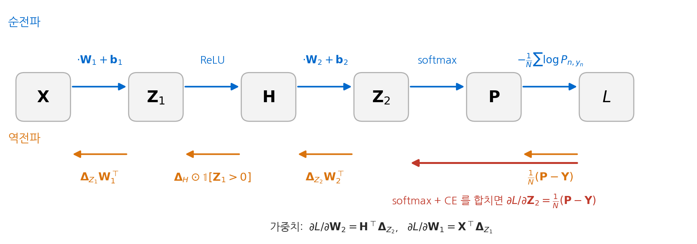
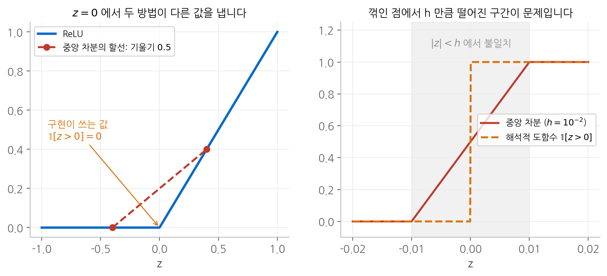
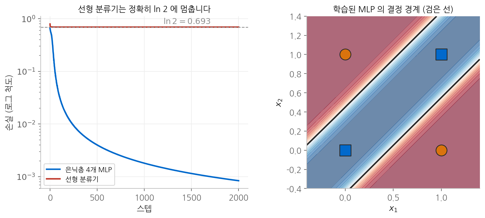

# 4. 역전파

역전파는 새로운 수학이 아니라 **연쇄 법칙을 계산하는 순서**입니다. 이 장에서는 왜 출력에서
입력 방향으로 계산해야 하는지를 비용으로 설명하고, 2층 MLP의 모든 그래디언트를 배치 단위로
유도합니다. 이어서 유도한 식을 검증하는 방법과 그 방법이 실패하는 특별한 경우를 수학적으로
분석하고, 마지막으로 은닉층이 없는 모델이 XOR을 절대로 배울 수 없다는 것을 증명합니다.

## 1. 왜 거꾸로 계산하는가

### 두 가지 계산 순서

함수 $L = f_3(f_2(f_1(\boldsymbol{\theta})))$ 에서 파라미터 $\boldsymbol{\theta} \in \mathbb{R}^n$ 에 대한 그래디언트는
연쇄 법칙에 따라 야코비안의 곱입니다.

$$
\frac{\partial L}{\partial \boldsymbol{\theta}}
= \underbrace{\frac{\partial L}{\partial \mathbf{a}_2}}_{1 \times k_2}
\underbrace{\frac{\partial \mathbf{a}_2}{\partial \mathbf{a}_1}}_{k_2 \times k_1}
\underbrace{\frac{\partial \mathbf{a}_1}{\partial \boldsymbol{\theta}}}_{k_1 \times n}
$$

행렬 곱은 결합 법칙이 성립하므로 어느 쪽부터 곱해도 결과는 같습니다. 그러나 **비용은 크게 다릅니다.**

- **왼쪽부터 곱하면**(출력에서 입력 방향) 첫 곱의 결과가 $1 \times k_1$ 행벡터이고, 다음 곱의 결과도
  $1 \times n$ 행벡터입니다. 중간 결과가 항상 벡터이므로 곱 한 번의 비용이 작습니다.
- **오른쪽부터 곱하면**(입력에서 출력 방향) 첫 곱의 결과가 $k_2 \times n$ 행렬입니다.
  파라미터 수 $n$ 만큼의 열을 가진 행렬을 계속 들고 다녀야 합니다.

손실은 스칼라 하나이고 파라미터는 수십억 개이므로, 앞의 방식이 압도적으로 유리합니다.
출력 쪽 끝이 스칼라라는 사실 덕분에 **역방향으로 한 번 훑는 것만으로 모든 파라미터의
그래디언트를 얻습니다.** 그 비용은 순전파 한 번의 몇 배 수준입니다.

반대로 입력 방향부터 계산하는 방식은 입력 방향 하나에 대한 민감도를 한 번에 하나씩 구합니다.
$n$ 개의 파라미터 모두에 대한 그래디언트가 필요하면 순전파에 해당하는 계산을 $n$ 번 반복해야 합니다.

### 대가: 중간 값을 저장해야 합니다

역방향 계산에는 순전파의 중간 값이 필요합니다. 예를 들어 ReLU의 역전파에는
$\mathbb{1}[\mathbf{Z}_1 > 0]$ 이, 가중치의 그래디언트에는 그 층의 입력이 필요합니다.
따라서 순전파를 하면서 이 값들을 모두 메모리에 남겨 두어야 합니다. 대규모 모델 학습에서
메모리의 상당 부분을 활성화 값이 차지하는 이유이며, 일부를 버렸다가 역전파 때 다시 계산하는
기법이 쓰이는 이유이기도 합니다.

## 2. 2층 MLP의 역전파 유도

### 설정

표본 $N$ 개를 행으로 쌓은 입력 $\mathbf{X} \in \mathbb{R}^{N \times d}$, 은닉 차원 $h$, 클래스 수 $c$ 인
분류 모델입니다.

$$
\begin{aligned}
\mathbf{Z}_1 &= \mathbf{X}\mathbf{W}_1 + \mathbf{1}\mathbf{b}_1^\top & &\mathbf{W}_1 \in \mathbb{R}^{d \times h} \\
\mathbf{H} &= \operatorname{ReLU}(\mathbf{Z}_1) & & \\
\mathbf{Z}_2 &= \mathbf{H}\mathbf{W}_2 + \mathbf{1}\mathbf{b}_2^\top & &\mathbf{W}_2 \in \mathbb{R}^{h \times c} \\
\mathbf{P} &= \operatorname{softmax}(\mathbf{Z}_2) & &\text{행별 적용} \\
L &= -\frac{1}{N} \sum_{n=1}^{N} \log P_{n, y_n} & &\text{평균 교차 엔트로피}
\end{aligned}
$$

정답을 원핫 행렬 $\mathbf{Y} \in \{0, 1\}^{N \times c}$ 로 두고, 어떤 행렬 $\mathbf{A}$ 에 대한 손실의 그래디언트를
$\boldsymbol{\Delta}_A = \partial L / \partial \mathbf{A}$ 로 쓰겠습니다. $\boldsymbol{\Delta}_A$ 는 항상 $\mathbf{A}$ 와 같은 형태입니다.

<figure markdown>

<figcaption>
위쪽 파란 화살표가 순전파, 아래쪽 주황 화살표가 역전파입니다. softmax 와 교차 엔트로피는
하나로 묶어서 한 번에 미분하고, 각 가중치의 그래디언트는 그 층의 입력과 위에서 내려온
그래디언트의 곱으로 얻습니다.
</figcaption>
</figure>

### 출력층: softmax와 교차 엔트로피를 한꺼번에

[3. 그래디언트](03-gradients.md)에서 표본 하나에 대해 $\partial L / \partial \mathbf{z} = \mathbf{p} - \operatorname{onehot}(t)$ 를
유도했습니다. 손실이 평균이므로 각 표본의 기여에 $1/N$ 이 붙고, 모든 행을 모으면 다음과 같습니다.

$$
\boldsymbol{\Delta}_{Z_2} = \frac{1}{N}(\mathbf{P} - \mathbf{Y})
$$

### 출력층 가중치

$\mathbf{W}_2$ 의 한 원소 $W_{2,ij}$ 는 모든 표본의 $Z_{2,nj}$ 에 쓰입니다.
$Z_{2,nj} = \sum_{i'} H_{ni'} W_{2,i'j} + b_{2,j}$ 이므로 $\partial Z_{2,nj} / \partial W_{2,ij} = H_{ni}$ 이고,
연쇄 법칙의 "경로끼리 더한다"에 따라 표본 $N$ 개의 기여를 모두 더합니다.

$$
\frac{\partial L}{\partial W_{2,ij}} = \sum_{n=1}^{N} \frac{\partial L}{\partial Z_{2,nj}} \frac{\partial Z_{2,nj}}{\partial W_{2,ij}}
= \sum_{n=1}^{N} H_{ni} \, (\boldsymbol{\Delta}_{Z_2})_{nj}
= (\mathbf{H}^\top \boldsymbol{\Delta}_{Z_2})_{ij}
$$

같은 논리로 편향은 모든 표본에 복제되어 쓰였으므로 행 방향으로 더합니다.

$$
\frac{\partial L}{\partial \mathbf{W}_2} = \mathbf{H}^\top \boldsymbol{\Delta}_{Z_2},
\qquad
\frac{\partial L}{\partial \mathbf{b}_2} = \sum_{n=1}^{N} (\boldsymbol{\Delta}_{Z_2})_{n,:}
$$

### 은닉 표현으로 거슬러 내려가기

$H_{ni}$ 는 표본 $n$ 의 모든 로짓 $Z_{2,n1}, \dots, Z_{2,nc}$ 에 쓰입니다. 경로가 $c$ 개입니다.

$$
\frac{\partial L}{\partial H_{ni}} = \sum_{j=1}^{c} (\boldsymbol{\Delta}_{Z_2})_{nj} W_{2,ij}
\qquad \Longrightarrow \qquad
\boldsymbol{\Delta}_H = \boldsymbol{\Delta}_{Z_2} \mathbf{W}_2^\top
$$

### ReLU를 통과시키기

ReLU는 원소별 함수이므로 야코비안이 대각 행렬이고, 역전파는 원소별 곱이 됩니다.

$$
\boldsymbol{\Delta}_{Z_1} = \boldsymbol{\Delta}_H \odot \mathbb{1}[\mathbf{Z}_1 > 0]
$$

순전파에서 0으로 잘린 위치는 역전파에서도 그래디언트가 0으로 잘립니다.
**ReLU는 순전파와 역전파에서 같은 위치에 같은 문을 닫습니다.**

### 은닉층 가중치

출력층과 같은 구조이므로 결과도 같은 모양입니다.

$$
\frac{\partial L}{\partial \mathbf{W}_1} = \mathbf{X}^\top \boldsymbol{\Delta}_{Z_1},
\qquad
\frac{\partial L}{\partial \mathbf{b}_1} = \sum_{n=1}^{N} (\boldsymbol{\Delta}_{Z_1})_{n,:}
$$

### 형태로 확인하기

| 그래디언트 | 식 | 형태 |
| --- | --- | --- |
| $\boldsymbol{\Delta}_{Z_2}$ | $\frac{1}{N}(\mathbf{P} - \mathbf{Y})$ | $N \times c$ |
| $\partial L / \partial \mathbf{W}_2$ | $\mathbf{H}^\top \boldsymbol{\Delta}_{Z_2}$ | $(h \times N)(N \times c) = h \times c$ |
| $\boldsymbol{\Delta}_H$ | $\boldsymbol{\Delta}_{Z_2} \mathbf{W}_2^\top$ | $(N \times c)(c \times h) = N \times h$ |
| $\boldsymbol{\Delta}_{Z_1}$ | $\boldsymbol{\Delta}_H \odot \mathbb{1}[\mathbf{Z}_1 > 0]$ | $N \times h$ |
| $\partial L / \partial \mathbf{W}_1$ | $\mathbf{X}^\top \boldsymbol{\Delta}_{Z_1}$ | $(d \times N)(N \times h) = d \times h$ |

모든 가중치 그래디언트가 **그 층의 입력의 전치 $\times$ 그 층 출력의 그래디언트**라는 같은 모양을 가집니다.
그리고 표본 축 $N$ 이 곱 안에서 합으로 사라집니다. 가중치는 모든 표본이 공유하므로,
그 그래디언트는 표본별 기여의 합이 되는 것이 자연스럽습니다.

## 3. 그래디언트 검증

### 중앙 차분과 상대 오차

손으로 유도한 식이 맞는지는 [3장](03-gradients.md)의 중앙 차분으로 확인합니다.
파라미터 하나 $\theta_i$ 를 $\pm h$ 만큼 흔들어 손실의 변화를 보면 다음과 같습니다.

$$
g_i^{\text{num}} = \frac{L(\theta_i + h) - L(\theta_i - h)}{2h} = \frac{\partial L}{\partial \theta_i} + O(h^2)
$$

해석적으로 구한 값 $g^{\text{an}}$ 과 비교할 때는 절대 오차보다 **상대 오차**를 봅니다.
그래디언트의 규모가 층마다 다르기 때문입니다.

$$
\text{rel} = \frac{\max_i |g_i^{\text{an}} - g_i^{\text{num}}|}{\max_i |g_i^{\text{num}}|}
$$

$h = 10^{-6}$ 정도를 쓰면 이론적 오차 $O(h^2)$ 와 부동소수점 반올림 오차 $O(\epsilon_{\text{mach}}/h)$ 가
대략 균형을 이루어, 올바른 구현에서 상대 오차가 $10^{-9}$ 에서 $10^{-10}$ 수준으로 나옵니다.

### 검증이 실패하는데 구현은 옳은 경우

XOR 데이터로 위의 2층 MLP를 만들고, 편향을 0으로 초기화한 상태에서 네 파라미터를 검증하면
다음과 같은 결과가 나옵니다.

| 파라미터 | 편향을 0으로 초기화 | 편향을 작은 난수로 초기화 |
| --- | --- | --- |
| $\mathbf{W}_1$ | $8.3 \times 10^{-10}$ | $3.7 \times 10^{-10}$ |
| $\mathbf{b}_1$ | **$0.81$** | $3.5 \times 10^{-10}$ |
| $\mathbf{W}_2$ | $1.5 \times 10^{-9}$ | $1.2 \times 10^{-9}$ |
| $\mathbf{b}_2$ | $6.4 \times 10^{-10}$ | $3.4 \times 10^{-10}$ |

$\mathbf{b}_1$ 만 크게 실패했고, 편향 초기화를 바꾸자 사라졌습니다. 식은 그대로인데 결과가 바뀐 것이므로
**구현의 오류가 아닙니다.** 원인은 ReLU의 꺾인 점에 있습니다.

### 원인: 꺾인 점에서 중앙 차분이 내놓는 값

XOR 입력 중 $(0, 0)$ 인 표본을 보겠습니다. $\mathbf{x} = \mathbf{0}$ 이고 $\mathbf{b}_1 = \mathbf{0}$ 이면
은닉층 사전 활성화가 가중치와 무관하게 정확히 0입니다.

$$
\mathbf{z}_1 = \mathbf{0}^\top \mathbf{W}_1 + \mathbf{0} = \mathbf{0}
$$

ReLU는 $z = 0$ 에서 미분할 수 없고, 구현은 관례에 따라 $\mathbb{1}[0 > 0] = 0$ 을 씁니다.
그런데 $b_{1,i}$ 를 $\pm h$ 만큼 흔들면 $z_{1,i} = \pm h$ 가 되어, ReLU 출력이 한쪽에서는 $h$, 다른 쪽에서는 $0$ 이 됩니다.
중앙 차분이 계산하는 ReLU의 "기울기"는 다음과 같습니다.

$$
\frac{\operatorname{ReLU}(h) - \operatorname{ReLU}(-h)}{2h} = \frac{h - 0}{2h} = \frac{1}{2}
$$

해석적 구현은 0을, 수치 미분은 $1/2$ 을 쓰는 셈이므로 두 값이 어긋날 수밖에 없습니다.

<figure markdown>

<figcaption>
왼쪽: z = 0 에서 ±h 를 잇는 할선의 기울기는 0.5 이지만, 구현은 0을 씁니다.
오른쪽: 꺾인 점에서 h 이내로 가까운 구간에서만 두 값이 어긋나고, 그 밖에서는 정확히 일치합니다.
</figcaption>
</figure>

### 그런데 왜 $\mathbf{W}_1$ 은 통과했는가

같은 표본에서 $W_{1,ji}$ 를 흔들면 어떻게 될까요? $z_{1,i} = \sum_j x_j W_{1,ji} + b_{1,i}$ 에서
$\mathbf{x} = \mathbf{0}$ 이므로 $W_{1,ji}$ 를 얼마나 바꾸든 $z_{1,i}$ 는 **여전히 정확히 0**입니다.
꺾인 점을 넘나들지 않으니 수치 미분에 문제가 생기지 않고, 해석적으로도
$\partial L / \partial W_{1,ji}$ 에 들어가는 이 표본의 기여가 $x_j (\boldsymbol{\Delta}_{Z_1})_{i} = 0$ 이라 두 값이 일치합니다.

반면 $b_{1,i}$ 는 $\mathbf{x}$ 와 곱해지지 않고 $z_{1,i}$ 를 직접 옮기므로, 이 표본에서 꺾인 점을 넘나들게 됩니다.
**같은 표본, 같은 뉴런인데 어느 파라미터를 흔드느냐에 따라 꺾인 점을 넘는지가 갈린 것입니다.**

편향을 작은 난수로 초기화하면 $z_{1,i} = b_{1,i} \neq 0$ 이 되어 꺾인 점에서 $h$ 보다 멀어지므로
네 파라미터 모두 통과합니다. ReLU 계열을 쓸 때 그래디언트 검증이 간헐적으로 실패한다면,
구현을 의심하기 전에 사전 활성화에 정확히 0이거나 0에 매우 가까운 값이 있는지 먼저 확인하는
편이 좋습니다.

## 4. 은닉층이 없으면 XOR을 배울 수 없다는 증명

### 선형 분류기의 손실은 정확히 $\ln 2$ 에 멈춥니다

은닉층 없이 로짓을 $\mathbf{Z} = \mathbf{X}\mathbf{W} + \mathbf{1}\mathbf{b}^\top$ ($\mathbf{W} \in \mathbb{R}^{2 \times 2}$) 로 두는 선형 분류기를
XOR로 학습시키면, 손실은 매끄럽게 수렴하지만 그 값은 정확히 $\ln 2 = 0.6931$ 입니다.
이것이 우연이 아니라 필연임을 보이겠습니다.

**1단계: 원점에서 그래디언트가 0입니다.** $\mathbf{W} = \mathbf{0}$, $\mathbf{b} = \mathbf{0}$ 이면 모든 로짓이 같으므로
모든 표본에서 $\mathbf{P}$ 의 행이 $(0.5, 0.5)$ 입니다. 따라서 $\mathbf{P} - \mathbf{Y}$ 의 행은 정답이 0인 표본에서
$(-0.5, 0.5)$, 정답이 1인 표본에서 $(0.5, -0.5)$ 입니다. 가중치의 그래디언트
$\frac{1}{N}\mathbf{X}^\top(\mathbf{P} - \mathbf{Y}) = \frac{1}{N}\sum_n \mathbf{x}_n (\mathbf{P} - \mathbf{Y})_{n,:}$ 에서 $x_1$ 에 해당하는 행을 계산하면
$x_1 = 1$ 인 표본 $(1, 0)$ 과 $(1, 1)$ 만 기여합니다.

$$
\underbrace{(0.5, -0.5)}_{(1,0),\ \text{정답 } 1} + \underbrace{(-0.5, 0.5)}_{(1,1),\ \text{정답 } 0} = (0, 0)
$$

$x_2$ 의 행도 대칭적으로 $(0,1)$ 과 $(1,1)$ 이 상쇄되어 0이고, 편향의 그래디언트
$\frac{1}{N}\sum_n (\mathbf{P} - \mathbf{Y})_{n,:}$ 도 정답 0인 표본 둘과 정답 1인 표본 둘이 상쇄되어 0입니다.
**원점은 정지점입니다.**

**2단계: 이 정지점은 전역 최솟값입니다.** 교차 엔트로피는 로짓에 대해 볼록 함수이고,
로짓이 파라미터의 선형 함수이면 볼록 함수와 선형 함수의 합성이므로 파라미터에 대해서도 볼록합니다.
볼록 함수에서 그래디언트가 0인 점은 전역 최솟값입니다.

**3단계: 그 값은 $\ln 2$ 입니다.** 원점에서 모든 표본의 정답 확률이 $0.5$ 이므로
$L = -\log 0.5 = \ln 2$ 입니다.

결론적으로 **선형 분류기가 도달할 수 있는 최선의 해가 "모든 입력에 대해 반반이라고 답하기"** 입니다.
어떤 학습률로 얼마나 오래 학습시켜도 이보다 나아질 수 없습니다.

<figure markdown>

<figcaption>
왼쪽: 같은 학습률 0.5 로 2000스텝을 학습시킨 손실입니다. 선형 분류기는 증명대로 ln 2 에
멈추고, 은닉 뉴런 4개인 MLP 는 0.00084 까지 내려갑니다. 오른쪽: 학습된 MLP 의 결정 경계로,
평행한 두 직선이 정답 1인 두 점을 대각선 띠 밖으로 분리합니다.
</figcaption>
</figure>

### 이 결과가 주는 교훈

선형 분류기의 학습은 **발산하지도, 오류를 내지도 않았습니다.** 손실은 안정적으로 수렴했고
그래디언트는 0이 되었습니다. 최적화 관점에서는 완벽하게 성공한 학습입니다.
다만 도달한 해가 무의미했을 뿐입니다.

$k$ 개 클래스를 균등하게 예측할 때의 교차 엔트로피는 $\ln k$ 입니다. 학습이 수렴했다고 판단하기 전에
최종 손실을 이 기준선과 비교해야 하는 이유가 여기에 있습니다. 손실 곡선이 평탄해졌다는 사실은
모델이 더 배울 수 없다는 뜻일 뿐, 무언가를 배웠다는 뜻은 아닙니다.

반대로 MLP는 오른쪽 그림처럼 은닉층의 ReLU가 입력 공간을 두 개의 평행한 경계로 나누어,
[1장](01-mlp.md)에서 손으로 구성한 것과 같은 방식으로 XOR을 풀었습니다.

## 정리

| 단계 | 순전파 | 역전파 |
| --- | --- | --- |
| 출력 | $\mathbf{P} = \operatorname{softmax}(\mathbf{Z}_2)$, $L = \mathrm{CE}$ | $\boldsymbol{\Delta}_{Z_2} = \frac{1}{N}(\mathbf{P} - \mathbf{Y})$ |
| 출력층 | $\mathbf{Z}_2 = \mathbf{H}\mathbf{W}_2 + \mathbf{b}_2$ | $\partial\mathbf{W}_2 = \mathbf{H}^\top\boldsymbol{\Delta}_{Z_2}$, $\ \boldsymbol{\Delta}_H = \boldsymbol{\Delta}_{Z_2}\mathbf{W}_2^\top$ |
| 활성화 | $\mathbf{H} = \operatorname{ReLU}(\mathbf{Z}_1)$ | $\boldsymbol{\Delta}_{Z_1} = \boldsymbol{\Delta}_H \odot \mathbb{1}[\mathbf{Z}_1 > 0]$ |
| 은닉층 | $\mathbf{Z}_1 = \mathbf{X}\mathbf{W}_1 + \mathbf{b}_1$ | $\partial\mathbf{W}_1 = \mathbf{X}^\top\boldsymbol{\Delta}_{Z_1}$ |
| 편향 | 모든 표본에 복제 | 표본 축으로 합 |

## 다음 장

역전파로 모든 파라미터의 그래디언트를 얻었습니다. [다음 장](05-optimizer.md)에서는
이 그래디언트를 실제 갱신량으로 바꾸는 규칙인 옵티마이저를 다룹니다.
