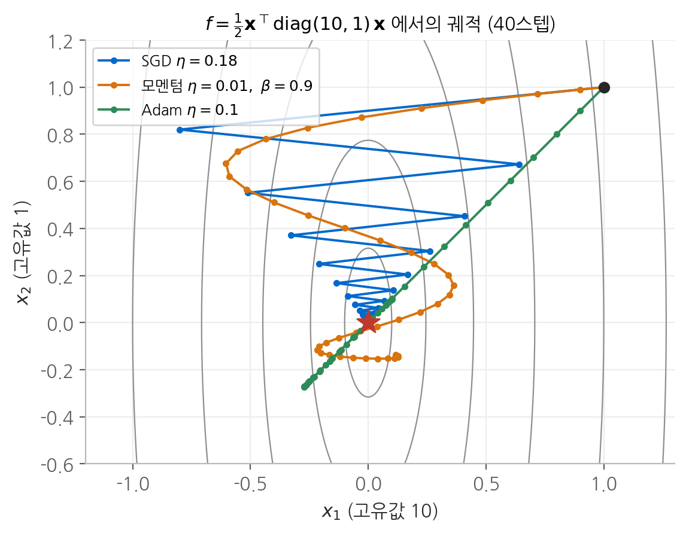
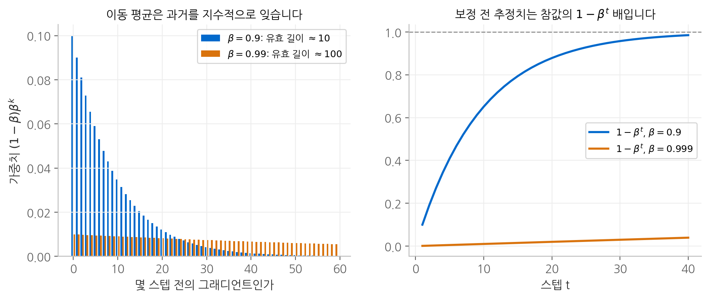
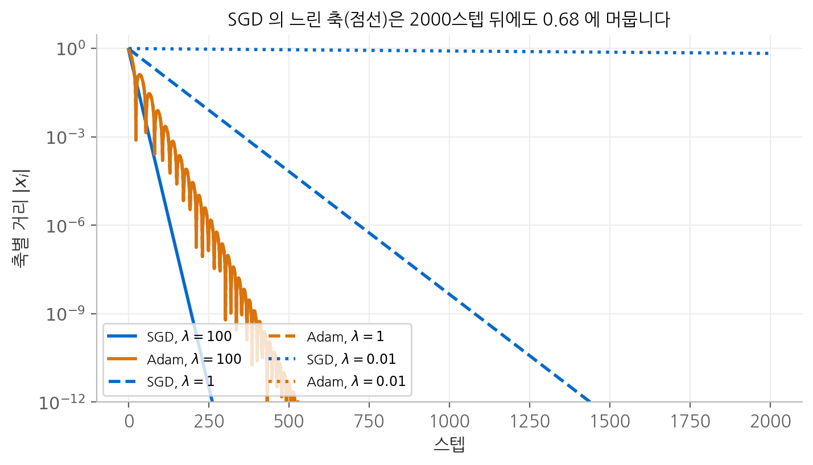
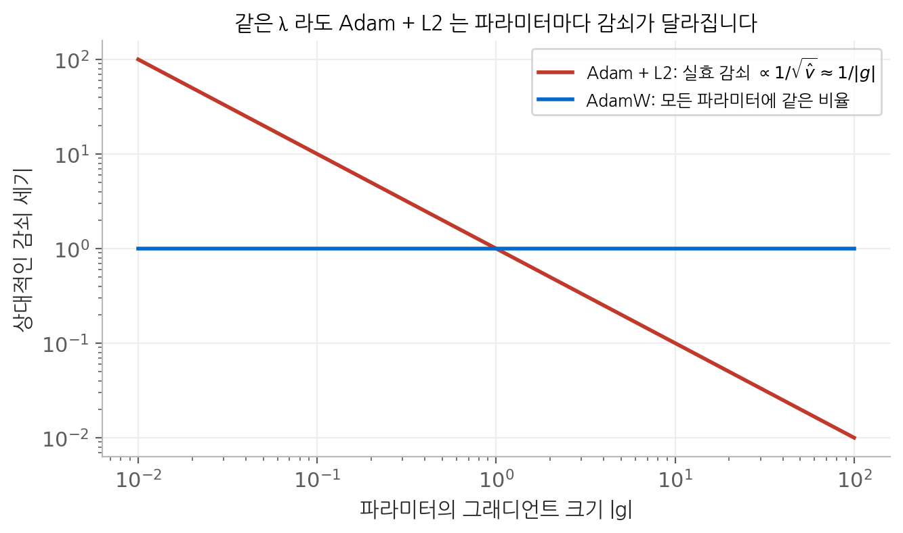

# 5. 옵티마이저

역전파는 각 파라미터에 대한 그래디언트를 줍니다. 그러나 그래디언트는 **현재 위치에서 손실이
가장 가파르게 증가하는 방향**일 뿐, 얼마나 움직여야 하는지도, 그 방향이 조금 떨어진 곳에서도
유효한지도 말해 주지 않습니다. 옵티마이저는 그래디언트를 실제 갱신량으로 바꾸는 규칙입니다.
이 장에서는 대표적인 옵티마이저를 수식으로 정의하고, 각 규칙이 어떤 문제를 풀려고 만들어졌으며
그 대가로 어떤 새로운 문제를 만드는지를 이차 함수 위에서 분석합니다.

## 1. 두 가지 기본 아이디어

대부분의 옵티마이저는 두 가지 통계량의 조합입니다.

| 통계량 | 정의 | 역할 |
| --- | --- | --- |
| 1차 모멘트 | 그래디언트의 이동 평균 | 방향을 매끄럽게 하고 관성을 줍니다. |
| 2차 모멘트 | 그래디언트 제곱의 이동 평균 | 파라미터마다 보폭을 따로 정합니다. |

아래의 모든 연산은 **원소별**입니다. $\mathbf{g}^2$ 은 벡터의 노름 제곱이 아니라 각 성분을 제곱한 벡터이고,
나눗셈과 제곱근도 성분마다 따로 계산합니다. 파라미터마다 보폭이 달라지는 원리가 여기에 있습니다.

## 2. 분석의 무대: 이차 함수

옵티마이저의 거동을 정확히 분석하려면 손실을 최솟값 근처에서 이차 함수로 근사하는 것이 편리합니다.

$$
f(\mathbf{x}) = \frac{1}{2} \mathbf{x}^\top \mathbf{A} \mathbf{x}, \qquad \nabla f(\mathbf{x}) = \mathbf{A} \mathbf{x}
$$

$\mathbf{A}$ 는 헤시안이고, 최솟값은 원점입니다. $\mathbf{A} = \operatorname{diag}(\lambda_1, \dots, \lambda_n)$ 인 대각 행렬이면
각 좌표가 서로 독립적으로 움직이므로 분석이 단순해집니다. 대각이 아니어도 고유벡터를 좌표축으로
잡으면 같은 형태가 되므로 일반성을 잃지 않습니다.

이 장에서는 주로 $\mathbf{A} = \operatorname{diag}(10, 1)$ 을 씁니다. 조건수가 $\kappa = 10$ 이라 한 축은 가파르고
다른 축은 완만한 골짜기 모양입니다.

## 3. SGD

$$
\mathbf{x}_{t+1} = \mathbf{x}_t - \eta\, \mathbf{g}_t
$$

이차 함수에 대입하면 각 좌표가 독립적으로 매 스텝 일정한 배율로 줄어듭니다.

$$
x_{i,t+1} = (1 - \eta \lambda_i)\, x_{i,t} \quad \Longrightarrow \quad x_{i,t} = (1 - \eta\lambda_i)^t\, x_{i,0}
$$

$|1 - \eta\lambda_i| < 1$ 이어야 모든 좌표가 수렴하므로 $\eta < 2 / \lambda_{\max}$ 입니다.
$\mathbf{A} = \operatorname{diag}(10, 1)$ 에서 $\eta = 0.18$ 을 쓰면 가파른 축의 배율은 $1 - 1.8 = -0.8$ 로
**부호를 바꿔 가며** 줄어들고, 완만한 축은 $1 - 0.18 = 0.82$ 로 한 방향으로 천천히 줄어듭니다.
이 비대칭이 아래 그림의 지그재그를 만듭니다. 학습률의 안정 조건은
[7. 경사 하강법과 학습률](07-learning-rate.md)에서 자세히 다룹니다.

<figure markdown>

<figcaption>
(1, 1) 에서 출발해 40스텝 이동한 궤적입니다. SGD 는 가파른 x₁ 축에서 부호를 바꾸며 튀고,
모멘텀은 관성 때문에 원점을 지나쳤다가 돌아오는 나선을 그립니다. Adam 은 두 축을 거의 같은
보폭으로 움직여 대각선을 따라 내려가다가 원점을 지나칩니다.
</figcaption>
</figure>

## 4. 모멘텀

### 정의와 이동 평균으로서의 해석

$$
\mathbf{v}_t = \beta \mathbf{v}_{t-1} + \mathbf{g}_t, \qquad \mathbf{x}_{t+1} = \mathbf{x}_t - \eta\, \mathbf{v}_t
$$

$\mathbf{v}_0 = \mathbf{0}$ 에서 시작해 점화식을 풀면, $\mathbf{v}_t$ 는 과거 그래디언트의 **지수 가중 합**입니다.

$$
\mathbf{v}_t = \mathbf{g}_t + \beta \mathbf{g}_{t-1} + \beta^2 \mathbf{g}_{t-2} + \cdots = \sum_{k=0}^{t-1} \beta^k\, \mathbf{g}_{t-k}
$$

$k$ 스텝 전의 그래디언트는 $\beta^k$ 의 가중치를 받습니다. $\beta = 0.9$ 이면 10스텝 전의 가중치가
$0.9^{10} \approx 0.35$, 20스텝 전은 $0.12$ 입니다. 과거를 **지수적으로 잊는** 기억 장치입니다.

<figure markdown>

<figcaption>
왼쪽: 이동 평균이 과거 그래디언트에 주는 가중치입니다. β 가 클수록 더 먼 과거까지 기억합니다.
오른쪽: 0에서 시작한 이동 평균이 초반에 참값의 몇 배로 추정되는지를 나타냅니다.
Adam 의 편향 보정이 이 곡선으로 나누는 것입니다.
</figcaption>
</figure>

### 효과 1: 일정한 방향으로는 가속합니다

그래디언트가 여러 스텝 동안 거의 같다면($\mathbf{g}_t \approx \mathbf{g}$) 등비급수의 합으로 다음을 얻습니다.

$$
\mathbf{v}_t \approx \mathbf{g} \sum_{k=0}^{\infty} \beta^k = \frac{\mathbf{g}}{1 - \beta}
$$

실효 보폭이 $\eta / (1 - \beta)$ 로, $\beta = 0.9$ 면 **10배** 커집니다. 완만하고 긴 골짜기를 따라 내려갈 때
그래디언트는 작지만 방향이 일정하므로, 모멘텀이 이를 누적해 빠르게 이동합니다.

### 효과 2: 진동하는 방향으로는 상쇄됩니다

그래디언트의 부호가 매 스텝 바뀐다면($\mathbf{g}_t \approx (-1)^t \mathbf{g}$) 다음과 같습니다.

$$
\mathbf{v}_t \approx \mathbf{g} \sum_{k=0}^{\infty} (-\beta)^k = \frac{\mathbf{g}}{1 + \beta}
$$

$\beta = 0.9$ 면 약 $0.53$ 배로 **줄어듭니다.** 지그재그 방향의 움직임은 억제되고 일관된 방향의 움직임은
증폭되므로, 골짜기를 가로지르는 진동이 줄고 골짜기를 따라 내려가는 속도가 빨라집니다.

### 대가: 학습률을 함께 낮춰야 합니다

실효 보폭이 커진다는 것은 안정 한계에 더 빨리 도달한다는 뜻입니다. 이차 함수에서 모멘텀을 쓰면
안정 조건이 $\eta < 2(1+\beta)/\lambda_{\max}$ 로 바뀌지만, 수렴 속도가 가장 빠른 영역은 훨씬 작은
학습률 쪽에 있습니다. 실제로 $\mathbf{A} = \operatorname{diag}(10, 1)$ 에서 $\beta = 0.9$ 로 60스텝을 비교하면,
$\eta = 0.01$ 에서는 모멘텀이 SGD보다 14배 가까이 좋지만 $\eta = 0.1$ 에서는 오히려 27배 나빠집니다.
**기존 설정에 모멘텀만 추가하면 학습이 불안정해지는 이유가 여기에 있습니다.**

### 네스테로프 모멘텀

그래디언트를 현재 위치가 아니라 **관성으로 이동할 위치**에서 계산합니다.

$$
\mathbf{v}_t = \beta \mathbf{v}_{t-1} + \nabla f(\mathbf{x}_t - \eta \beta \mathbf{v}_{t-1}), \qquad \mathbf{x}_{t+1} = \mathbf{x}_t - \eta\, \mathbf{v}_t
$$

관성이 과하게 지나치려는 순간, 앞질러 본 위치의 그래디언트가 이미 반대 방향을 가리키므로 미리
제동이 걸립니다. 같은 이차 함수에서 거리 $10^{-3}$ 에 도달하는 데 일반 모멘텀은 129스텝, 네스테로프는
97스텝이 걸립니다.

## 5. 적응적 보폭: AdaGrad와 RMSProp

### AdaGrad

$$
\mathbf{s}_t = \mathbf{s}_{t-1} + \mathbf{g}_t^2, \qquad \mathbf{x}_{t+1} = \mathbf{x}_t - \frac{\eta}{\sqrt{\mathbf{s}_t} + \epsilon} \odot \mathbf{g}_t
$$

좌표마다 지금까지의 그래디언트 제곱합으로 나눕니다. 그래디언트가 크게 들어온 좌표는 보폭이 작아지고,
작게 들어온 좌표는 보폭이 커집니다. **곡률이 큰 축은 천천히, 작은 축은 빠르게** 움직이므로 조건수의
영향이 완화됩니다.

문제는 $\mathbf{s}_t$ 가 **단조 증가**한다는 점입니다. 합을 계속 쌓기만 하므로 실효 보폭 $\eta / \sqrt{\mathbf{s}_t}$ 가
계속 줄어들고, 학습이 길어지면 결국 거의 움직이지 않게 됩니다. 스텝 수가 정해진 볼록 문제에서는
이 감소가 오히려 수렴을 보장하는 장점이지만, 수십만 스텝을 학습하는 신경망에서는 약점입니다.

### RMSProp

$$
\mathbf{s}_t = \beta \mathbf{s}_{t-1} + (1 - \beta)\, \mathbf{g}_t^2, \qquad \mathbf{x}_{t+1} = \mathbf{x}_t - \frac{\eta}{\sqrt{\mathbf{s}_t} + \epsilon} \odot \mathbf{g}_t
$$

합 대신 이동 평균을 써서 오래된 그래디언트를 잊습니다. AdaGrad와의 차이는 한 글자뿐이지만,
$\mathbf{s}_t$ 가 최근 그래디언트의 규모만 반영하므로 보폭이 영원히 줄어들지 않습니다.

### 척도 불변성과 그 부작용

RMSProp의 갱신량에서 그래디언트를 모두 $c$ 배 하면 어떻게 될까요? $\mathbf{s}_t$ 는 $c^2$ 배가 되고,
$\sqrt{\mathbf{s}_t}$ 는 $c$ 배가 됩니다($\epsilon$ 을 무시하면).

$$
\frac{\eta\, (c\,\mathbf{g})}{\sqrt{c^2 \mathbf{s}}} = \frac{\eta\, \mathbf{g}}{\sqrt{\mathbf{s}}}
$$

**갱신량이 그래디언트의 크기와 무관합니다.** 층마다 그래디언트 규모가 몇 자릿수씩 달라도 비슷한
보폭으로 움직일 수 있다는 것이 장점입니다.

그러나 같은 성질이 최솟값 근처에서는 문제가 됩니다. 최솟값에 가까워지면 그래디언트가 작아지는데,
$\sqrt{\mathbf{s}_t}$ 도 함께 작아지므로 **보폭이 줄어들지 않습니다.** SGD에서는 그래디언트 크기가
"거의 다 왔다"는 신호였는데, 정규화가 그 신호를 지워 버립니다. $\mathbf{A} = \operatorname{diag}(10, 1)$ 에서
$\eta = 0.05$ 로 실험하면, 거리가 $10^{-17}$ 까지 내려간 80스텝 무렵 실효 보폭 $\eta/\sqrt{s}$ 는
가파른 축에서 약 $0.38$ 로 안정 한계 $2/\lambda_{\max} = 0.2$ 를 넘고, 이후 거리가 다시 $10^{-2}$ 수준으로
벌어집니다. 적응적 옵티마이저에 학습률 스케줄을 함께 쓰는 이유가 이것입니다.

## 6. Adam

### 정의

Adam은 모멘텀의 1차 모멘트와 RMSProp의 2차 모멘트를 함께 씁니다.

$$
\begin{aligned}
\mathbf{m}_t &= \beta_1 \mathbf{m}_{t-1} + (1 - \beta_1)\, \mathbf{g}_t \\
\mathbf{v}_t &= \beta_2 \mathbf{v}_{t-1} + (1 - \beta_2)\, \mathbf{g}_t^2 \\
\hat{\mathbf{m}}_t &= \frac{\mathbf{m}_t}{1 - \beta_1^t}, \qquad \hat{\mathbf{v}}_t = \frac{\mathbf{v}_t}{1 - \beta_2^t} \\
\mathbf{x}_{t+1} &= \mathbf{x}_t - \eta\, \frac{\hat{\mathbf{m}}_t}{\sqrt{\hat{\mathbf{v}}_t} + \epsilon}
\end{aligned}
$$

기본값은 $\beta_1 = 0.9$, $\beta_2 = 0.999$ 입니다.

### 편향 보정이 필요한 이유

$\mathbf{m}_0 = \mathbf{0}$ 에서 시작한 이동 평균을 펼치면 다음과 같습니다.

$$
\mathbf{m}_t = (1 - \beta_1) \sum_{k=1}^{t} \beta_1^{t-k}\, \mathbf{g}_k
$$

그래디언트의 분포가 시간에 따라 변하지 않는다고 가정하고 기댓값을 취하면, 가중치의 합이
등비급수로 계산됩니다.

$$
\mathbb{E}[\mathbf{m}_t] = \mathbb{E}[\mathbf{g}] \cdot (1 - \beta_1) \sum_{k=0}^{t-1} \beta_1^{k} = \mathbb{E}[\mathbf{g}] \cdot (1 - \beta_1^t)
$$

**이동 평균은 참값의 $1 - \beta_1^t$ 배로 과소 추정됩니다.** 가중치의 합이 1이 되지 않기 때문입니다.
$t$ 가 커지면 $\beta_1^t \to 0$ 이라 치우침이 사라지지만, 초반에는 심각합니다. 따라서 $1 - \beta_1^t$ 로
나누면 정확히 보정됩니다. $\mathbf{v}_t$ 도 같은 논리로 $1 - \beta_2^t$ 로 나눕니다.

치우침의 정도가 두 모멘트에서 다르다는 점이 중요합니다. 그래디언트가 항상 $g$ 인 첫 스텝을 보면
$m_1 = 0.1g$, $v_1 = 0.001 g^2$ 이므로 보정하지 않은 갱신량은 다음과 같습니다.

$$
\frac{m_1}{\sqrt{v_1}} = \frac{0.1\, g}{\sqrt{0.001}\, |g|} = \frac{0.1}{0.0316} \approx 3.16
$$

$\beta_2$ 가 $\beta_1$ 보다 1에 훨씬 가까워서 분모가 더 심하게 과소 추정되고, 그 결과
**첫 스텝의 보폭이 3.16배로 부풀려집니다.** 보정하면 $\hat{m}_1 = g$, $\hat{v}_1 = g^2$ 이 되어 정확히 1입니다.
학습 첫 스텝은 초기화 직후로 가장 불확실한 시점인데, 편향 보정이 없으면 바로 그때 가장 크게 움직입니다.

### 적응적 방법이 확실히 유리한 조건

앞의 $\mathbf{A} = \operatorname{diag}(10, 1)$ 처럼 차원이 작고 잡음이 없는 문제에서는, 이론적으로 최적인 학습률을 쓴
SGD가 매우 강력합니다. 실제로 200스텝 후 원점까지의 거리는 다음과 같습니다.

| 옵티마이저 | 학습률 | 200스텝 후 거리 | $10^{-3}$ 도달 |
| --- | --- | --- | --- |
| SGD | 0.18 | $5.8 \times 10^{-18}$ | 36스텝 |
| 모멘텀 | 0.01 | $4.5 \times 10^{-6}$ | 129스텝 |
| 네스테로프 | 0.01 | $8.0 \times 10^{-6}$ | 97스텝 |
| AdaGrad | 0.5 | $3.2 \times 10^{-49}$ | 13스텝 |
| RMSProp | 0.05 | $3.5 \times 10^{-2}$ | 36스텝 |
| Adam | 0.1 | $1.0 \times 10^{-5}$ | 82스텝 |

이 표는 성능 순위표가 아닙니다. 조정의 여지가 거의 없는 문제에서 적응적 방법이 보탤 것은 많지 않습니다.
적응적 방법의 가치는 **축마다 규모가 극단적으로 다를 때** 드러납니다.

$\mathbf{A} = \operatorname{diag}(100, 1, 0.01)$ 로 조건수를 $10^4$ 으로 키워 보겠습니다. SGD는 안정 조건 때문에
$\eta < 2/100 = 0.02$ 여야 합니다. $\eta = 0.019$ 를 쓰면 가장 완만한 축의 배율은 다음과 같습니다.

$$
1 - \eta \lambda_{\min} = 1 - 0.019 \times 0.01 = 0.99981
$$

2000스텝 뒤의 남은 값은 $0.99981^{2000} = e^{2000 \ln 0.99981} \approx e^{-0.38} \approx 0.684$ 입니다.
**2000스텝을 돌고도 출발점에서 32%밖에 줄지 않습니다.** 가장 가파른 축이 보폭을 묶어 두어
가장 완만한 축이 거의 움직이지 못하는 것입니다.

Adam은 좌표마다 $\sqrt{\hat{v}_i}$ 로 나누므로, 규모가 $\lambda_i$ 에 비례해 달랐던 그래디언트가 비슷한 크기로
정규화됩니다. 앞서 본 척도 불변성 덕분에 세 축이 곡률과 무관하게 비슷한 속도로 움직이고,
같은 2000스텝에서 세 축 모두 0에 도달합니다.

<figure markdown>

<figcaption>
고유값이 100, 1, 0.01 인 이차 함수에서 축별 거리의 변화입니다. SGD(파랑)는 가파른 두 축이
빠르게 0으로 가지만 가장 완만한 축(점선)은 0.68 에 머뭅니다. Adam(주황)은 세 축이 모두 수렴합니다.
</figcaption>
</figure>

실제 대규모 모델에서는 층과 파라미터 종류에 따라 그래디언트 규모가 몇 자릿수씩 다르고,
각각에 맞는 학습률을 따로 찾는 것은 현실적이지 않습니다. Adam 계열이 표준이 된 이유가 여기에 있습니다.

## 7. AdamW: 가중치 감쇠의 분리

### L2 정규화를 Adam에 그대로 넣으면

가중치가 지나치게 커지지 않도록 손실에 $\frac{\lambda}{2}\lVert \boldsymbol{\theta} \rVert^2$ 을 더하는 것을 L2 정규화라고 합니다.
미분하면 그래디언트에 $\lambda \boldsymbol{\theta}$ 가 더해집니다. SGD에서는 이것이 매 스텝 파라미터를
$(1 - \eta\lambda)$ 배로 줄이는 **가중치 감쇠**와 정확히 같습니다.

$$
\boldsymbol{\theta} \leftarrow \boldsymbol{\theta} - \eta(\mathbf{g} + \lambda \boldsymbol{\theta}) = (1 - \eta\lambda)\,\boldsymbol{\theta} - \eta\,\mathbf{g}
$$

그런데 Adam에서는 두 방식이 달라집니다. L2 항까지 $\sqrt{\hat{\mathbf{v}}}$ 로 나뉘기 때문입니다.

$$
\textbf{Adam + L2} \quad \boldsymbol{\theta} \leftarrow \boldsymbol{\theta} - \eta\, \frac{\widehat{\mathbf{m}}[\mathbf{g} + \lambda\boldsymbol{\theta}]}{\sqrt{\hat{\mathbf{v}}} + \epsilon}
\qquad
\textbf{AdamW} \quad \boldsymbol{\theta} \leftarrow \boldsymbol{\theta} - \eta\, \frac{\hat{\mathbf{m}}}{\sqrt{\hat{\mathbf{v}}} + \epsilon} - \eta\lambda\boldsymbol{\theta}
$$

$\sqrt{\hat{v}_i}$ 는 대략 좌표 $i$ 의 그래디언트 크기 $|g_i|$ 를 따라가므로, Adam + L2에서 좌표 $i$ 가 받는
실효 감쇠는 대략 $\lambda / |g_i|$ 에 비례합니다. **그래디언트가 큰 파라미터는 거의 감쇠되지 않고,
그래디언트가 작은 파라미터는 과도하게 감쇠됩니다.** 의도한 것은 "모든 가중치를 같은 비율로 줄인다"였는데,
실제로는 그래디언트 크기에 반비례해 제각각 줄이는 셈입니다.

<figure markdown>

<figcaption>
같은 감쇠 계수 λ 를 주어도, Adam + L2 에서는 그래디언트 크기에 반비례해 감쇠의 세기가 달라집니다.
AdamW 는 감쇠를 정규화 바깥에서 적용하므로 모든 파라미터에 같은 비율로 작용합니다.
</figcaption>
</figure>

### 구체적인 예

두 파라미터가 같은 값 1에서 출발하고, 손실에서 오는 그래디언트가 각각 $10$ 과 $0.1$ 로 일정하다고 하겠습니다.
$\lambda = 0.1$, $\eta = 0.01$ 로 200스텝을 진행하면 결과는 다음과 같습니다.

| 방식 | 첫 번째 ($g = 10$) | 두 번째 ($g = 0.1$) |
| --- | --- | --- |
| Adam + L2 | $-0.992$ | $-0.504$ |
| AdamW | $-0.993$ | $-0.993$ |

AdamW에서는 두 값이 같습니다. Adam의 척도 불변성 때문에 크기가 100배 다른 두 그래디언트가 같은 보폭을
만들고, 감쇠도 같은 비율로 적용되기 때문입니다.

Adam + L2에서는 두 값이 갈라졌습니다. 첫 번째 파라미터에서는 감쇠 항 $\lambda\theta \approx 0.1$ 이
그래디언트 10의 1%에 불과해 흔적 없이 묻혔습니다. 두 번째 파라미터에서는 같은 $0.1$ 이 그래디언트 0.1과
**같은 규모**라서 합쳐진 그래디언트 자체를 바꿔 놓았고, 그 결과 움직임이 크게 달라졌습니다.
감쇠 계수의 의미가 파라미터마다 달라지므로 하이퍼파라미터를 예측하기 어려워집니다.

AdamW는 감쇠를 적응적 정규화와 분리해서, 정규화의 세기를 그래디언트 규모와 무관하게 조절할 수 있게 합니다.
오늘날 LLM 학습의 사실상 표준 옵티마이저입니다.

## 정리

| 옵티마이저 | 핵심 수식 | 해결한 문제 | 새로 생긴 문제 |
| --- | --- | --- | --- |
| SGD | $\mathbf{x} - \eta\mathbf{g}$ | | 가장 가파른 축이 보폭을 묶음 |
| 모멘텀 | $\mathbf{v} = \beta\mathbf{v} + \mathbf{g}$ | 일정한 방향 가속, 진동 억제 | 실효 보폭 $1/(1-\beta)$ 배 |
| 네스테로프 | 앞질러 본 위치의 $\nabla f$ | 모멘텀의 과잉 이동 | |
| AdaGrad | $\mathbf{s} = \mathbf{s} + \mathbf{g}^2$ | 축별 보폭 조절 | 보폭이 계속 줄어 멈춤 |
| RMSProp | $\mathbf{s} = \beta\mathbf{s} + (1-\beta)\mathbf{g}^2$ | 보폭이 멈추지 않음 | 최솟값 근처에서도 보폭 유지 |
| Adam | 1차와 2차 모멘트, 편향 보정 | 둘의 장점 결합, 초반 안정화 | L2 정규화와의 충돌 |
| AdamW | 감쇠를 정규화 밖에서 적용 | 감쇠가 파라미터마다 일정 | |

## 다음 장

옵티마이저는 그래디언트를 갱신량으로 바꾸는 규칙입니다. 그렇다면 그래디언트는 애초에 무엇을
향하도록 만들어지는 것일까요? [다음 장](06-loss.md)에서는 그 방향을 정하는 손실 함수를 다룹니다.
