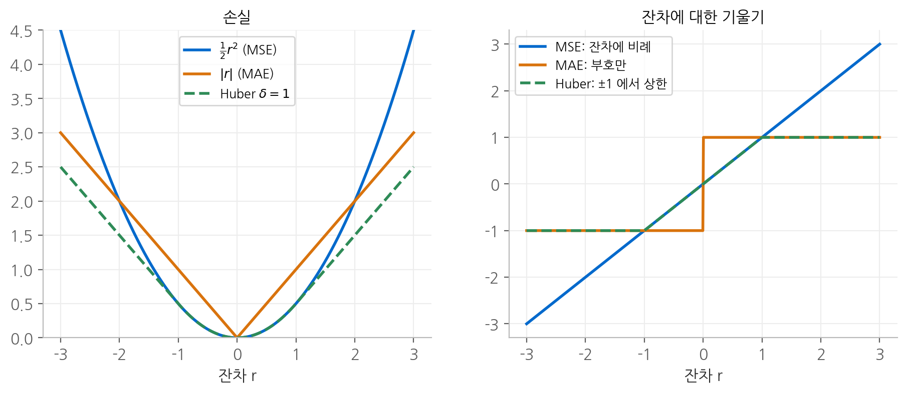
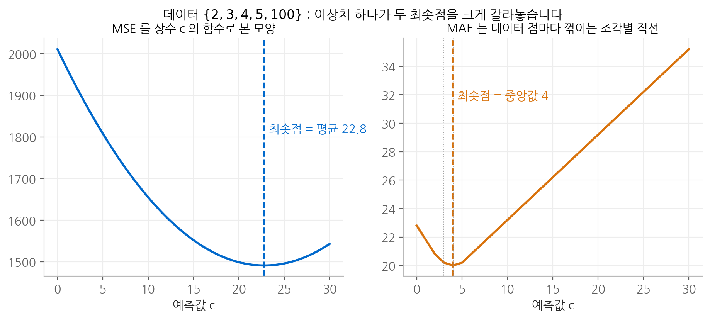
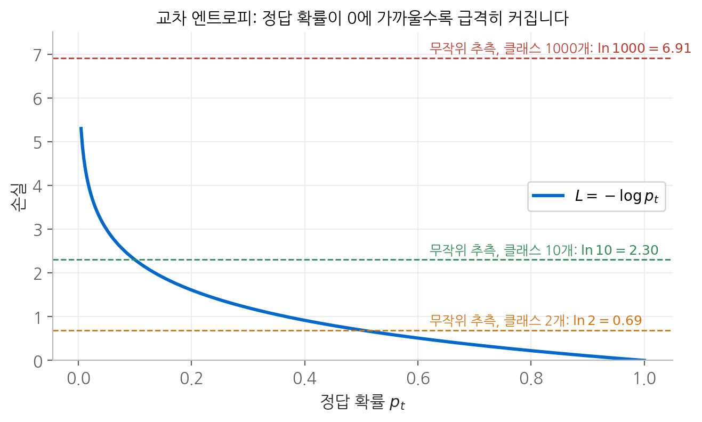
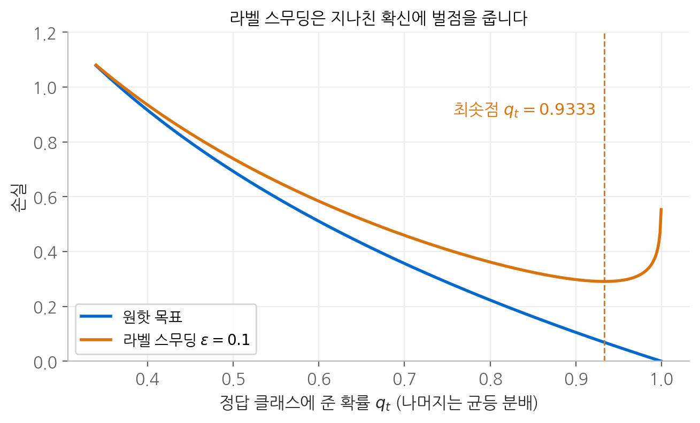

# 6. 손실 함수

손실 함수는 모델의 출력과 정답 사이의 거리를 **스칼라 하나로 요약합니다.** 스칼라여야 하는 이유는
분명합니다. 역전파가 효율적인 것은 출력 쪽 끝이 스칼라이기 때문이었습니다. 그러나 손실 함수의 역할은
거리를 재는 데서 끝나지 않습니다. **손실 함수는 모델이 무엇을 최적이라고 여길지를 결정합니다.**
이 장에서는 회귀와 분류의 대표적인 손실 함수가 각각 어떤 해를 최적으로 만드는지, 그리고 그 선택이
확률 모델의 어떤 가정과 대응하는지를 유도합니다.

## 1. 회귀 손실

잔차를 $r = y - \hat{y}$ 로 두면 대표적인 세 손실은 다음과 같습니다.

$$
\text{MSE} = \frac{1}{N}\sum_{n} r_n^2,
\qquad
\text{MAE} = \frac{1}{N}\sum_{n} |r_n|,
\qquad
\text{Huber}_\delta(r) =
\begin{cases}
\frac{1}{2} r^2 & |r| \leq \delta \\[4pt]
\delta\left(|r| - \frac{1}{2}\delta\right) & |r| > \delta
\end{cases}
$$

Huber 손실의 상수항 $-\frac{1}{2}\delta^2$ 은 $|r| = \delta$ 에서 두 조각의 **값과 기울기가 모두 연속**이 되도록
맞춘 것입니다. $|r| = \delta$ 를 대입하면 두 식 모두 $\frac{1}{2}\delta^2$ 이고, 기울기는 각각 $\delta$ 로 같습니다.

<figure markdown>

<figcaption>
왼쪽은 잔차에 따른 손실이고, 오른쪽은 잔차에 대한 기울기입니다. MSE 의 기울기는 잔차에 비례해
끝없이 커지고, MAE 의 기울기는 크기가 항상 1이며, Huber 는 작은 잔차에서 MSE 처럼, 큰 잔차에서
MAE 처럼 동작합니다.
</figcaption>
</figure>

### MSE를 최소화하는 상수는 평균입니다

입력과 무관하게 상수 $c$ 하나로 모든 $y_n$ 을 예측한다고 하겠습니다. MSE를 $c$ 로 미분해 0으로 둡니다.

$$
\frac{d}{dc} \frac{1}{N}\sum_{n}(y_n - c)^2 = -\frac{2}{N}\sum_{n}(y_n - c) = 0
\quad \Longrightarrow \quad
c^* = \frac{1}{N}\sum_{n} y_n = \bar{y}
$$

2차 도함수가 $2 > 0$ 이므로 이 점은 최솟값입니다. **MSE의 최적 상수는 평균**입니다.

### MAE를 최소화하는 상수는 중앙값입니다

$|y - c|$ 는 $c = y$ 에서 미분할 수 없지만, 그 밖에서는 $\frac{d}{dc}|y - c| = \operatorname{sign}(c - y)$ 입니다.

$$
\frac{d}{dc} \sum_{n}|y_n - c| = \sum_{n} \operatorname{sign}(c - y_n) = \#\{n : y_n < c\} - \#\{n : y_n > c\}
$$

기울기는 **$c$ 보다 작은 데이터의 개수에서 큰 데이터의 개수를 뺀 값**입니다. $c$ 를 왼쪽에서 오른쪽으로
옮기면 이 값은 음수에서 양수로 바뀌고, 그 경계에서 작은 쪽과 큰 쪽의 개수가 같아집니다.
그 점이 **중앙값**입니다.

이 유도에서 중요한 관찰이 하나 나옵니다. 기울기는 **데이터의 값이 아니라 개수에만** 의존합니다.
어떤 데이터 점을 아무리 멀리 옮겨도, 그 점이 $c$ 의 같은 쪽에 머무는 한 기울기는 변하지 않습니다.

### 이상치 하나가 만드는 차이

데이터 $\{2, 3, 4, 5, 100\}$ 에서 두 최적값을 구하면 다음과 같습니다.

$$
c^*_{\text{MSE}} = \frac{2 + 3 + 4 + 5 + 100}{5} = 22.8,
\qquad
c^*_{\text{MAE}} = \operatorname{median} = 4
$$

<figure markdown>

<figcaption>
같은 데이터에 대해 MSE 와 MAE 를 예측값 c 의 함수로 그렸습니다. MSE 는 매끄러운 포물선이고
최솟점이 평균 22.8 입니다. MAE 는 데이터 점마다 꺾이는 조각별 직선이고 최솟점이 중앙값 4 입니다.
</figcaption>
</figure>

**MSE가 고른 22.8은 다섯 개 데이터 중 어느 것과도 가깝지 않습니다.** 이상치 $100$ 하나를 제외한 네 개가
2에서 5 사이에 있는데도 그렇습니다. 평균의 유도에서 보았듯이 MSE의 기울기는 잔차에 비례하므로,
멀리 있는 점일수록 더 세게 잡아당기고, 이상치 하나가 나머지 전부를 합친 것보다 큰 영향력을 갖게 됩니다.

MSE가 틀린 것은 아닙니다. 제곱 오차의 합을 최소화하라는 정의를 정확히 따랐습니다.
문제는 그 목적이 우리가 원한 것과 달랐다는 데 있습니다. Huber 손실은 이상치에 대해서는 MAE처럼
기울기를 $\delta$ 로 제한해서, 작은 오차에 대한 MSE의 매끄러움과 큰 오차에 대한 MAE의 강건함을 함께 얻습니다.

### 확률 모델로 본 회귀 손실

손실 함수의 선택은 **데이터의 잡음에 대한 가정**과 대응합니다. 관측값이 $y = \mu + \varepsilon$ 이고
잡음 $\varepsilon$ 이 정규 분포 $\mathcal{N}(0, \sigma^2)$ 를 따른다고 가정하면, 음의 로그 우도는 다음과 같습니다.

$$
-\log p(y \mid \mu) = \frac{(y - \mu)^2}{2\sigma^2} + \frac{1}{2}\log(2\pi\sigma^2)
$$

$\mu$ 와 무관한 두 번째 항을 버리면 **MSE를 최소화하는 것은 정규 잡음 가정 하의 최대 우도 추정**과 같습니다.
잡음이 라플라스 분포 $p(\varepsilon) \propto e^{-|\varepsilon|/b}$ 를 따른다고 가정하면 같은 과정으로
**MAE**가 나옵니다.

라플라스 분포는 정규 분포보다 꼬리가 두껍습니다. 정규 분포의 로그 확률은 거리의 제곱으로 떨어지므로
큰 잔차를 "거의 일어날 수 없는 일"로 보고 모델을 크게 옮겨서라도 설명하려 하고, 라플라스 분포는
거리에 선형으로 떨어지므로 큰 잔차를 "가끔 있는 일"로 받아들입니다. 이상치에 대한 두 손실의 태도 차이가
여기서 나옵니다.

## 2. 분류 손실: 교차 엔트로피

### 음의 로그 우도에서 유도하기

모델이 표본 $n$ 에 대해 클래스별 확률 $\mathbf{p}_n$ 을 내놓는다고 하겠습니다. 표본들이 독립이라면
정답 전체가 관측될 확률, 즉 우도는 각 표본의 정답 확률의 곱입니다.

$$
\mathcal{L} = \prod_{n=1}^{N} p_{n, y_n}
$$

확률을 계속 곱하면 값이 빠르게 작아집니다. 정답 확률이 평균 0.5인 표본 1000개만 곱해도
$0.5^{1000} \approx 10^{-301}$ 로 부동소수점의 표현 한계에 닿습니다. 로그를 취하면 곱이 합으로 바뀌고,
부호를 뒤집고 평균을 내면 교차 엔트로피가 됩니다.

$$
L = -\frac{1}{N}\log\mathcal{L} = -\frac{1}{N}\sum_{n=1}^{N}\log p_{n, y_n}
$$

로그는 단조 증가 함수이므로 우도를 최대화하는 파라미터와 $L$ 을 최소화하는 파라미터는 같습니다.
**교차 엔트로피 최소화는 범주형 분포에 대한 최대 우도 추정입니다.**

예를 들어 표본 세 개의 정답 확률이 $0.659, 0.802, 0.830$ 이면 우도는 $0.439$ 이고,
$-\frac{1}{3}\log 0.439 = 0.2744$ 가 교차 엔트로피와 정확히 같습니다.

### 이름의 유래: 두 분포 사이의 교차 엔트로피

정답 분포를 $\mathbf{q}$, 모델 분포를 $\mathbf{p}$ 라 하면 교차 엔트로피는 다음과 같이 정의됩니다.

$$
H(\mathbf{q}, \mathbf{p}) = -\sum_{i} q_i \log p_i
$$

정답이 원핫이면 $q_t = 1$ 이고 나머지가 0이므로 $H(\mathbf{q}, \mathbf{p}) = -\log p_t$ 로 위의 손실과 같습니다.
이 양은 엔트로피와 쿨백-라이블러 발산으로 분해됩니다.

$$
H(\mathbf{q}, \mathbf{p})
= \underbrace{-\sum_i q_i \log q_i}_{H(\mathbf{q})}
+ \underbrace{\sum_i q_i \log \frac{q_i}{p_i}}_{D_{\mathrm{KL}}(\mathbf{q} \,\|\, \mathbf{p})}
$$

정답 분포의 엔트로피 $H(\mathbf{q})$ 는 모델과 무관한 상수이므로, **교차 엔트로피를 최소화하는 것은
정답 분포와 모델 분포 사이의 KL 발산을 최소화하는 것과 같습니다.** KL 발산은 항상 0 이상이고
두 분포가 같을 때만 0이므로(깁스 부등식), 교차 엔트로피의 최솟값은 $H(\mathbf{q})$ 이고 그때 $\mathbf{p} = \mathbf{q}$ 입니다.

<figure markdown>

<figcaption>
정답 확률에 따른 교차 엔트로피입니다. 정답 확률이 1에 가까우면 손실이 0에 가깝고, 0에 가까워질수록
손실이 무한히 커집니다. 점선은 클래스 수에 따른 무작위 추측의 기준선 ln k 입니다.
</figcaption>
</figure>

### 무작위 추측의 기준선: $\ln k$

아무것도 모르는 모델은 모든 클래스에 같은 확률 $1/k$ 를 줍니다. 이때 손실은 정답과 무관하게 다음과 같습니다.

$$
L = -\log \frac{1}{k} = \ln k
$$

| 클래스 수 $k$ | $\ln k$ |
| --- | --- |
| 2 | 0.693 |
| 10 | 2.303 |
| 1,000 | 6.908 |
| 50,000 | 10.820 |

어휘가 5만 개인 언어 모델이라면 학습 첫 스텝의 손실은 10.82 근처여야 정상입니다. 초기화가 적절하면
로짓이 모두 작고 비슷하므로 softmax가 거의 균등하기 때문입니다. 첫 손실이 이 값과 크게 다르다면
학습률을 조정하기 전에 **구현을 먼저 의심해야 합니다.** 훨씬 크면 초기화가 잘못되었거나 라벨이 어긋난 것이고,
훨씬 작으면 정답이 입력에 새어 들어갔을 가능성이 있습니다.

## 3. 수치 안정성: 로짓에서 바로 계산하기

$\log(\operatorname{softmax}(\mathbf{z}))$ 를 두 단계로 계산하면 두 곳에서 무너질 수 있습니다.

- **넘침.** $z_i > 709.78$ 이면 $e^{z_i}$ 가 64비트 부동소수점의 최댓값을 넘어 무한대가 됩니다.
- **아래 넘침.** 정답 확률이 $10^{-324}$ 보다 작으면 0으로 반올림되고, $\log 0 = -\infty$ 가 되어 손실이 발산합니다.

두 문제 모두 로그를 지수 안으로 들여보내면 사라집니다. $m = \max_j z_j$ 라 하면 다음과 같습니다.

$$
\log p_i = \log \frac{e^{z_i}}{\sum_j e^{z_j}}
= z_i - \log \sum_j e^{z_j}
= (z_i - m) - \log \sum_j e^{z_j - m}
$$

$z_j - m \leq 0$ 이므로 지수 항이 1을 넘지 않아 넘침이 없고, 합에는 $e^0 = 1$ 이 반드시 들어 있어
로그 안이 1 이상이므로 $\log 0$ 도 생기지 않습니다. 확률을 거치지 않고 로짓에서 로그 확률을 바로 얻는 이 방식을
**log-sum-exp 기법**이라고 부릅니다.

[3장](03-gradients.md)에서 softmax와 교차 엔트로피를 합치면 그래디언트가 $\mathbf{p} - \operatorname{onehot}(t)$ 로
단순해진다는 것을 보았습니다. 순전파의 수치 안정성과 역전파의 단순함이라는 두 가지 이유로,
두 연산은 항상 하나로 묶어서 계산합니다.

## 4. 퍼플렉서티

퍼플렉서티는 교차 엔트로피에 지수를 씌운 값입니다.

$$
\mathrm{PPL} = \exp(L) = \exp\!\left(-\frac{1}{N}\sum_n \log p_{n, y_n}\right) = \left(\prod_n p_{n, y_n}\right)^{-1/N}
$$

마지막 형태가 해석을 줍니다. 퍼플렉서티는 **정답 확률의 기하 평균의 역수**입니다.
모델이 매번 정답에 $1/k$ 의 확률을 주었다면 퍼플렉서티는 정확히 $k$ 입니다.

| 정답 확률 | 교차 엔트로피 | 퍼플렉서티 |
| --- | --- | --- |
| 거의 1 | 0 | 1 |
| 0.5 | 0.693 | 2 |
| 0.1 | 2.303 | 10 |

따라서 퍼플렉서티는 **"매 스텝 평균적으로 몇 개의 선택지 사이에서 균등하게 망설이는 것과 같은가"** 로 읽습니다.
손실 2.303은 감이 잘 오지 않지만 "선택지 10개 수준"이라고 하면 바로 와닿습니다. 담고 있는 정보는
교차 엔트로피와 완전히 같고, 해석하기 쉬운 단위로 바꾼 것입니다.

## 5. 라벨 스무딩

### 원핫 목표는 무한한 로짓을 요구합니다

원핫 목표에서 손실 $-\log p_t$ 를 0으로 만들려면 $p_t = 1$ 이어야 합니다. softmax로 이를 달성하려면
$p_t = 1 / (1 + \sum_{j \neq t} e^{z_j - z_t})$ 에서 모든 $z_t - z_j \to \infty$ 여야 합니다.
**손실에 최솟값이 존재하지 않고, 로짓 차이를 무한히 벌리는 방향으로 계속 밀립니다.**

### 목표를 부드럽게 만들기

라벨 스무딩은 정답에 몰린 확률 중 $\epsilon$ 만큼을 모든 클래스에 고르게 나눠 줍니다.

$$
\tilde{\mathbf{q}} = (1 - \epsilon)\,\operatorname{onehot}(t) + \frac{\epsilon}{K}\mathbf{1}
$$

$\epsilon = 0.1$, $K = 3$ 이면 $\tilde{\mathbf{q}} = (0.9333, 0.0333, 0.0333)$ 입니다.

앞의 KL 분해에 따라 이 목표에 대한 교차 엔트로피는 $\mathbf{p} = \tilde{\mathbf{q}}$ 에서 최소이고, 그 최솟값은
목표 분포의 엔트로피입니다.

$$
H(\tilde{\mathbf{q}}) = -0.9333\ln 0.9333 - 2 \times 0.0333 \ln 0.0333 \approx 0.291
$$

**이제 손실에 유한한 최솟점이 생겼습니다.** 그 점에서 정답 로짓과 나머지 로짓의 차이도 유한합니다.

$$
z_t - z_j = \log\frac{p_t}{p_j} = \log\frac{0.9333}{0.0333} = \log 28 \approx 3.33
$$

<figure markdown>

<figcaption>
정답 확률 q_t 를 바꾸며 나머지 확률을 균등하게 나눴을 때의 손실입니다. 원핫 목표는 q_t 가 1에
다가갈수록 계속 줄어들 뿐 멈추는 지점이 없습니다. 라벨 스무딩은 q_t = 0.9333 에서 최솟값 0.291 을
갖고, 그보다 확신하면 손실이 다시 올라갑니다.
</figcaption>
</figure>

### 그래디언트로 보면

[3장](03-gradients.md)의 유도를 원핫 대신 $\tilde{\mathbf{q}}$ 로 반복하면 그래디언트는 다음과 같습니다.

$$
\frac{\partial L}{\partial \mathbf{z}} = \mathbf{p} - \tilde{\mathbf{q}}
$$

원핫 목표에서는 $p_t < 1$ 인 한 정답 로짓의 그래디언트 $p_t - 1$ 이 항상 음수라 로짓을 계속 올리지만,
스무딩된 목표에서는 $p_t$ 가 $0.9333$ 을 넘는 순간 $p_t - \tilde{q}_t$ 가 양수가 되어 **로짓을 오히려 끌어내립니다.**
이 제동 덕분에 로짓이 무한정 커지지 않아 학습이 안정되고, 모델이 내놓는 확률이 실제 정답률에 더 가까워집니다.

## 정리

| 손실 | 최적 해 | 대응하는 확률 가정 | 특징 |
| --- | --- | --- | --- |
| MSE | 평균 | 정규 잡음 | 매끄럽지만 이상치에 민감 |
| MAE | 중앙값 | 라플라스 잡음 | 이상치에 강건, 0에서 미분 불가 |
| Huber | 중앙값에 가까움 | | 작은 오차는 MSE, 큰 오차는 MAE처럼 |
| 교차 엔트로피 | $\mathbf{p} = \mathbf{q}$ | 범주형 분포 | KL 발산 최소화와 동치, 기준선 $\ln k$ |
| 라벨 스무딩 | $\mathbf{p} = \tilde{\mathbf{q}}$ | | 유한한 최솟점, 과도한 확신 억제 |

## 다음 장

손실 함수가 최적화의 목표 지점을 정한다면, [다음 장](07-learning-rate.md)의 학습률은 그 지점까지
**얼마만 한 보폭으로 다가갈지**를 정합니다.
