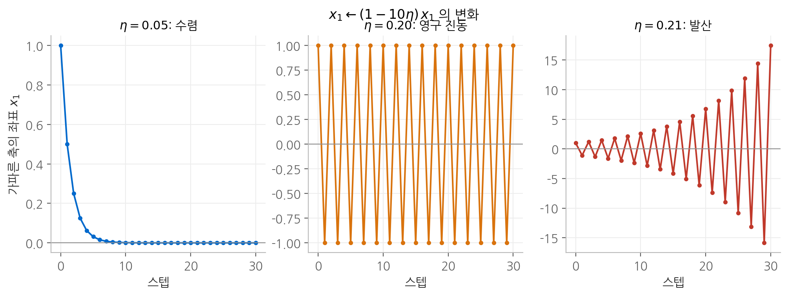
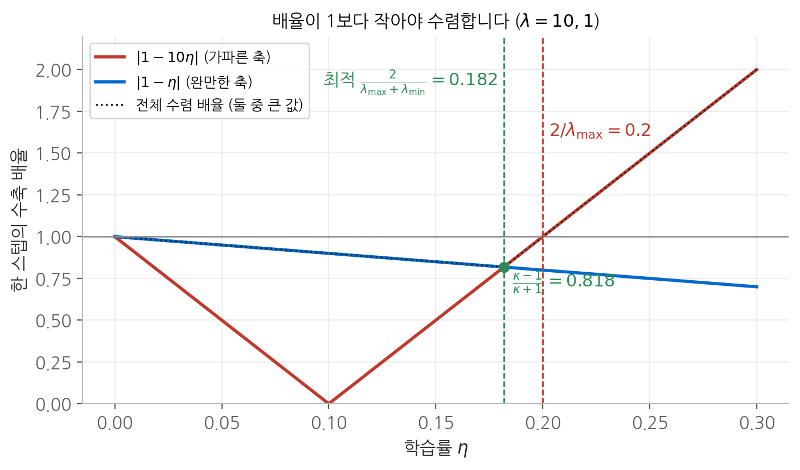
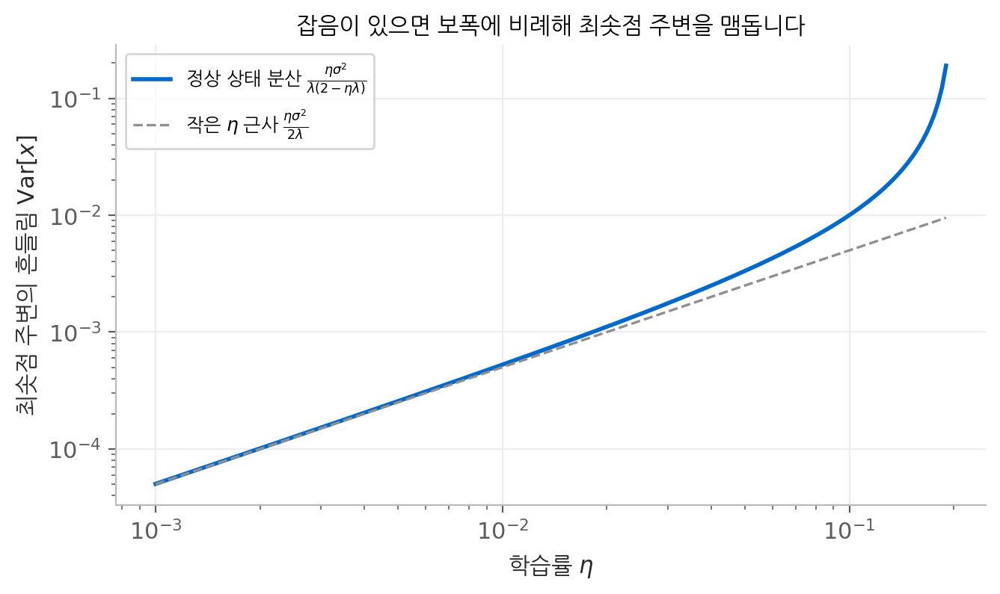
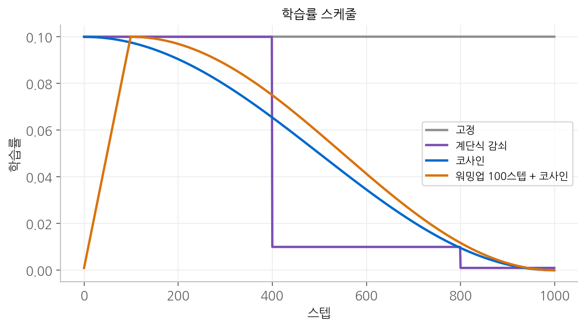

# 7. 경사 하강법과 학습률

그래디언트가 방향을 정해 준다면, **학습률이 정하는 것은 보폭 하나뿐입니다.** 그런데 이 하나가
학습의 성패를 가릅니다. 이 장에서는 이차 함수 위에서 학습률의 안정 조건과 최적값을 정확히 유도하고,
미니배치 잡음이 있을 때 학습률이 최종 도달점을 어떻게 제한하는지 계산합니다. 이 계산이
학습률 스케줄이 필요한 이유를 설명해 줍니다.

## 1. 갱신 규칙과 그 한계

$$
\boldsymbol{\theta}_{t+1} = \boldsymbol{\theta}_t - \eta \nabla L(\boldsymbol{\theta}_t)
$$

이 규칙의 근거는 1차 테일러 근사입니다. 이동량을 $\Delta = -\eta\nabla L$ 로 두면 다음과 같습니다.

$$
L(\boldsymbol{\theta} + \Delta) \approx L(\boldsymbol{\theta}) + \nabla L^\top \Delta = L(\boldsymbol{\theta}) - \eta \lVert \nabla L \rVert^2
$$

근사식만 보면 $\eta$ 를 키울수록 손실이 더 많이 줄어들 것처럼 보입니다. 그러나 이 근사는 **이동량이 작을 때만**
정확합니다. 2차 항까지 포함하면 다음과 같습니다.

$$
L(\boldsymbol{\theta} - \eta\mathbf{g}) \approx L(\boldsymbol{\theta}) - \eta\lVert\mathbf{g}\rVert^2 + \frac{\eta^2}{2}\mathbf{g}^\top\mathbf{H}\mathbf{g}
$$

손실 감소량은 $\eta$ 에 비례하지만 곡률에 의한 증가량은 $\eta^2$ 에 비례합니다. $\eta$ 가 작을 때는 감소가 이기고,
어느 지점을 넘으면 증가가 이깁니다. 학습률에는 **넘으면 안 되는 상한**이 존재할 수밖에 없습니다.

## 2. 이차 함수에서의 정확한 분석

### 좌표마다 독립적인 등비수열

손실을 최솟값 근처에서 $f(\mathbf{x}) = \frac{1}{2}\mathbf{x}^\top\mathbf{A}\mathbf{x}$ 로 근사하고, $\mathbf{A}$ 의 고유벡터를 좌표축으로 잡으면
$\mathbf{A} = \operatorname{diag}(\lambda_1, \dots, \lambda_n)$ 입니다. 갱신식은 다음과 같이 좌표마다 분리됩니다.

$$
\mathbf{x}_{t+1} = (\mathbf{I} - \eta\mathbf{A})\,\mathbf{x}_t
\quad \Longrightarrow \quad
x_{i,t} = (1 - \eta\lambda_i)^t\, x_{i,0}
$$

좌표 $i$ 는 매 스텝 **수축 배율** $\rho_i = 1 - \eta\lambda_i$ 를 곱해 가는 등비수열입니다.

### 안정 조건

모든 좌표가 0으로 수렴하려면 모든 $i$ 에서 $|\rho_i| < 1$ 이어야 합니다.

$$
-1 < 1 - \eta\lambda_i < 1 \quad \Longleftrightarrow \quad 0 < \eta < \frac{2}{\lambda_i}
$$

모든 좌표에서 성립해야 하므로 가장 엄격한 조건이 남습니다.

$$
0 < \eta < \frac{2}{\lambda_{\max}}
$$

**가장 큰 고유값 하나가 학습률의 상한을 결정합니다.** 다른 축이 아무리 완만해도 가장 가파른 축이
발산하지 않도록 보폭을 맞춰야 합니다.

### 경계에서 일어나는 일

$\mathbf{A} = \operatorname{diag}(10, 1)$ 이면 $2/\lambda_{\max} = 0.2$ 입니다. 가파른 축의 배율 $\rho_1 = 1 - 10\eta$ 를 보면
세 가지 영역이 뚜렷이 나뉩니다.

| 학습률 | 배율 $\rho_1$ | 거동 |
| --- | --- | --- |
| $\eta = 0.05$ | $0.5$ | 매 스텝 절반으로 줄며 한 방향으로 수렴 |
| $\eta = 0.2$ | $-1$ | 크기는 그대로, 부호만 바뀌며 **영원히 진동** |
| $\eta = 0.21$ | $-1.1$ | 부호를 바꾸며 매 스텝 10%씩 커져 **발산** |

$\eta = 0.21$ 은 경계를 5%만 넘었을 뿐이지만, 30스텝 뒤 크기는 $1.1^{30} \approx 17$ 배,
60스텝 뒤에는 $1.1^{60} \approx 304$ 배가 됩니다. 학습률을 키울 때 손실이 서서히 나빠지는 것이 아니라
**어느 지점을 지나는 순간 갑자기 무너지는** 이유가 이 지수적 성장에 있습니다.

<figure markdown>

<figcaption>
가파른 축의 좌표가 스텝마다 변하는 모습입니다. 배율이 0.5 이면 빠르게 수렴하고,
−1 이면 같은 두 값을 영원히 오가며, −1.1 이면 진폭이 지수적으로 커집니다.
</figcaption>
</figure>

### 최적의 고정 학습률

전체 수렴 속도는 가장 느린 좌표가 정합니다. 즉 $\max_i |\rho_i|$ 를 최소화하는 $\eta$ 가 최적입니다.
$\eta$ 가 작으면 완만한 축의 배율 $1 - \eta\lambda_{\min}$ 이 1에 가까워 느리고, 크면 가파른 축의 배율
$|1 - \eta\lambda_{\max}|$ 가 커집니다. 두 값이 같아지는 점에서 최대값이 가장 작아집니다.

$$
1 - \eta\lambda_{\min} = \eta\lambda_{\max} - 1
\quad \Longrightarrow \quad
\eta^* = \frac{2}{\lambda_{\max} + \lambda_{\min}}
$$

이때의 수렴 배율은 조건수 $\kappa = \lambda_{\max}/\lambda_{\min}$ 만으로 표현됩니다.

$$
\rho^* = 1 - \eta^*\lambda_{\min} = \frac{\lambda_{\max} - \lambda_{\min}}{\lambda_{\max} + \lambda_{\min}} = \frac{\kappa - 1}{\kappa + 1}
$$

<figure markdown>

<figcaption>
λ = 10, 1 일 때 학습률에 따른 두 축의 수축 배율입니다. 전체 수렴 속도는 둘 중 큰 값(점선)이
정하고, 두 직선이 만나는 η = 0.182 에서 가장 작은 값 0.818 을 가집니다. η = 0.2 를 넘으면
가파른 축의 배율이 1을 넘어 발산합니다.
</figcaption>
</figure>

$\kappa = 10$ 이면 $\rho^* = 9/11 \approx 0.818$ 입니다. 오차를 $\varepsilon$ 배로 줄이는 데 필요한 스텝 수는
$\rho^{*t} = \varepsilon$ 에서 다음과 같습니다.

$$
t = \frac{\ln(1/\varepsilon)}{\ln\frac{\kappa + 1}{\kappa - 1}} \approx \frac{\kappa}{2}\ln\frac{1}{\varepsilon} \qquad (\kappa \gg 1)
$$

**필요한 스텝 수가 조건수에 비례합니다.** 조건수가 10배 커지면 최적 학습률을 쓰더라도 10배 오래 걸립니다.
학습률만으로는 이 한계를 넘을 수 없다는 점이 [5장](05-optimizer.md)의 모멘텀과 적응적 옵티마이저가
필요한 근본적인 이유입니다.

### 모멘텀이 바꾸는 것

모멘텀을 쓰면 실효 보폭이 $\eta/(1-\beta)$ 로 커지므로 같은 $\eta$ 에서 안정 한계에 더 빨리 닿습니다.
대신 $\eta$ 와 $\beta$ 를 함께 최적으로 고르면 수렴 배율이 다음과 같이 개선됩니다.

$$
\rho^*_{\text{momentum}} = \frac{\sqrt{\kappa} - 1}{\sqrt{\kappa} + 1}
$$

$\kappa$ 가 $\sqrt{\kappa}$ 로 바뀌었습니다. $\kappa = 10$ 이면 $0.818$ 이 $0.519$ 가 되고, 필요한 스텝 수가
$\kappa$ 대신 $\sqrt{\kappa}$ 에 비례하게 됩니다. $\kappa = 10^4$ 이라면 100배 차이입니다.
다만 이 개선은 두 하이퍼파라미터를 문제에 맞게 정확히 골랐을 때의 이야기이며, 앞서 보았듯이
학습률을 그대로 둔 채 모멘텀만 추가하면 오히려 불안정해질 수 있습니다.

## 3. 미니배치 잡음과 학습률

### 미니배치 그래디언트는 잡음이 섞인 추정치입니다

실제 학습에서는 전체 데이터 대신 미니배치 $B$ 개로 그래디언트를 추정합니다.

$$
\hat{\mathbf{g}} = \frac{1}{B}\sum_{n \in \mathcal{B}} \nabla \ell_n(\boldsymbol{\theta})
$$

표본을 무작위로 뽑으면 $\mathbb{E}[\hat{\mathbf{g}}] = \nabla L$ 이므로 **평균적으로는 올바른 방향**입니다.
그러나 표본마다의 그래디언트가 흩어져 있으므로 매번 조금씩 어긋나고, 그 분산은 독립 표본 $B$ 개의
평균이므로 $1/B$ 에 비례합니다.

### 잡음이 있으면 최솟점에 도달하지 못합니다

1차원 이차 함수 $f(x) = \frac{1}{2}\lambda x^2$ 에서 그래디언트에 평균 0, 분산 $\sigma^2$ 인 잡음 $\xi_t$ 가
더해진다고 하겠습니다.

$$
x_{t+1} = x_t - \eta(\lambda x_t + \xi_t) = (1 - \eta\lambda)\,x_t - \eta\,\xi_t
$$

$x_t$ 와 $\xi_t$ 가 독립이라면 분산은 다음 점화식을 따릅니다.

$$
\operatorname{Var}[x_{t+1}] = (1 - \eta\lambda)^2 \operatorname{Var}[x_t] + \eta^2\sigma^2
$$

안정 조건 $|1 - \eta\lambda| < 1$ 이 성립하면 이 수열은 정상 상태로 수렴합니다.
$\operatorname{Var}[x_{t+1}] = \operatorname{Var}[x_t] = V$ 로 두고 풀면 다음과 같습니다.

$$
V = \frac{\eta^2\sigma^2}{1 - (1 - \eta\lambda)^2} = \frac{\eta\,\sigma^2}{\lambda(2 - \eta\lambda)} \approx \frac{\eta\,\sigma^2}{2\lambda} \qquad (\eta\lambda \ll 1)
$$

**잡음이 있으면 최솟점 주변에서 분산 $V$ 만큼 계속 흔들리고, 그 폭은 학습률에 비례합니다.**
평균은 0으로 수렴하지만 개별 궤적은 최솟점에 머물지 못합니다.

<figure markdown>

<figcaption>
λ = 10, σ = 1 일 때 학습률에 따른 정상 상태 분산입니다. 학습률이 작은 영역에서는 η 에 정비례하고,
안정 한계 0.2 에 가까워질수록 급격히 커집니다.
</figcaption>
</figure>

이 결과에서 실용적인 결론이 세 가지 나옵니다.

- **학습 후반에는 학습률을 줄여야 합니다.** 큰 학습률로는 빠르게 최솟점 근처에 도달하지만 그 이상 내려가지
  못하고, 학습률을 줄이면 흔들림의 폭이 비례해서 줄어듭니다. 학습률 스케줄이 필요한 이유입니다.
- **배치 크기와 학습률은 짝을 이룹니다.** $\sigma^2 \propto 1/B$ 이므로 $V \propto \eta/B$ 입니다. 배치를 $k$ 배로
  키우면 학습률을 $k$ 배 키워도 흔들림의 폭이 대략 유지됩니다. 큰 배치로 학습할 때 학습률을 함께 키우는
  경험 법칙이 여기서 나옵니다.
- **잡음이 없으면 학습률을 줄일 이유도 없습니다.** $\sigma = 0$ 이면 $V = 0$ 이고, 학습률을 줄이는 것은
  수렴을 늦출 뿐입니다.

세 번째 결론은 실험으로도 확인됩니다. 표본 4개짜리 XOR 문제를 전체 배치로, 즉 잡음 없이 1000스텝
학습시키면 최종 손실은 고정 학습률이 $0.0119$ 로 가장 낮고, 계단식 감쇠는 $0.0346$, 코사인 스케줄은
$0.0292$ 였습니다. 스케줄이 쓸모없다는 뜻이 아니라, **이 실험에는 스케줄이 줄여 줄 잡음이 없었기**
때문입니다. 작은 문제에서 얻은 결론을 그대로 큰 학습에 옮기면 안 되는 사례입니다.

## 4. 학습률 스케줄

| 스케줄 | 수식 ($t$: 현재 스텝, $T$: 전체 스텝) |
| --- | --- |
| 고정 | $\eta_t = \eta_0$ |
| 계단식 감쇠 | $\eta_t = \eta_0 \cdot \gamma^{\lfloor t / s \rfloor}$ |
| 코사인 | $\eta_t = \eta_0 \cdot \frac{1}{2}\left(1 + \cos\frac{\pi t}{T}\right)$ |
| 워밍업 + 코사인 | $t < w$ 에서 $\eta_0 \frac{t}{w}$, 이후 $w$ 부터 $T$ 까지 코사인 |

<figure markdown>

<figcaption>
전체 1000스텝, 초기 학습률 0.1 인 네 가지 스케줄입니다. 계단식 감쇠는 400스텝마다 10분의 1로,
코사인은 0까지 부드럽게 줄고, 워밍업 스케줄은 처음 100스텝 동안 0에서 선형으로 올라간 뒤 줄어듭니다.
</figcaption>
</figure>

### 코사인 스케줄의 모양

코사인 스케줄은 초반과 후반에 천천히, 중반에 빠르게 줄어듭니다. 도함수를 보면 이유가 드러납니다.

$$
\frac{d\eta_t}{dt} = -\frac{\pi\eta_0}{2T}\sin\frac{\pi t}{T}
$$

$t = 0$ 과 $t = T$ 에서 기울기가 0이고 $t = T/2$ 에서 가장 가파릅니다. 학습 초반에는 큰 보폭을 오래 유지해서
빠르게 이동하고, 후반에는 작은 보폭을 오래 유지해서 앞 절의 흔들림을 충분히 줄이는 모양입니다.

### 워밍업이 필요한 이유

학습 첫 스텝은 여러 면에서 가장 위험한 시점입니다.

- 초기화 직후의 파라미터는 손실 표면에서 곡률이 큰 영역에 있는 경우가 많습니다. 곡률이 크면
  안정 한계 $2/\lambda_{\max}$ 가 낮으므로, 이후 단계에 적합한 학습률이 초반에는 한계를 넘을 수 있습니다.
- Adam의 2차 모멘트 $\hat{\mathbf{v}}_t$ 는 편향 보정으로 평균의 치우침은 없어지지만, 초반에는 표본 몇 개로만
  추정하므로 분산이 큽니다. 어떤 좌표에서 $\hat{v}_i$ 가 우연히 작게 추정되면 그 좌표의 보폭이 크게 부풀려집니다.

워밍업은 이 구간 동안 학습률을 0에서 천천히 올려서, 곡률과 통계량이 안정된 뒤에 본래의 학습률에 도달하게 합니다.

## 5. 학습률을 고르는 실제 방법

같은 2층 MLP를 XOR로 학습률만 바꿔 300스텝 학습시키면 결과는 다음과 같습니다.

| 학습률 | 최종 손실 | 판정 |
| --- | --- | --- |
| 0.05 | 0.158 | 느림 |
| 0.5 | 0.0071 | 정상 수렴 |
| 5 | 1.044 | 실패 |
| 50 | 13.4 | 실패 |

학습률 5의 손실 $1.044$ 는 무작위 추측의 기준선 $\ln 2 = 0.693$ 보다도 **높습니다.** 300스텝을 학습하고도
아무것도 모르는 상태보다 나쁜 자리에 있다는 뜻입니다. 여기서 몇 가지 지침이 나옵니다.

- **좋은 학습률은 한 점이 아니라 구간입니다.** 위에서 0.5 근처가 가장 좋았지만 0.05도 느릴 뿐 틀리지는
  않았습니다. 안정 한계 아래에서는 성능이 완만하게 변하고, 한계 위에서는 급격히 무너집니다.
  따라서 10배 단위로 훑어서 무너지는 지점을 찾은 뒤, 그보다 몇 배 작은 값에서 조정하는 편이 효율적입니다.
- **손실이 발산하면 학습률을 먼저 의심합니다.** 발산은 대개 $\eta > 2/\lambda_{\max}$ 인 방향이 생겼다는 신호입니다.
  구현 오류를 찾기 전에 학습률을 10분의 1로 줄여 보는 것이 훨씬 빠릅니다.
- **초기 손실을 $\ln k$ 와 비교합니다.** 시작값부터 기준선과 크게 다르면 학습률이 아니라 구현이나 데이터의 문제입니다.
- **옵티마이저, 모멘텀, 배치 크기를 바꾸면 학습률도 다시 맞춥니다.** 모두 실효 보폭이나 잡음의 크기를 바꾸기 때문입니다.

## 정리

| 개념 | 핵심 수식 | 의미 |
| --- | --- | --- |
| 수축 배율 | $\rho_i = 1 - \eta\lambda_i$ | 좌표마다 독립적인 등비수열 |
| 안정 조건 | $\eta < 2/\lambda_{\max}$ | 넘는 순간 지수적으로 발산 |
| 최적 고정 학습률 | $\eta^* = 2/(\lambda_{\max} + \lambda_{\min})$ | 수렴 배율 $(\kappa - 1)/(\kappa + 1)$ |
| 필요한 스텝 수 | $\approx \frac{\kappa}{2}\ln\frac{1}{\varepsilon}$ | 조건수에 비례 |
| 모멘텀 | $(\sqrt{\kappa} - 1)/(\sqrt{\kappa} + 1)$ | 조건수 의존성을 $\sqrt{\kappa}$ 로 완화 |
| 잡음 하의 흔들림 | $V \approx \eta\sigma^2/(2\lambda)$ | 학습률에 비례, 스케줄이 필요한 이유 |
| 배치 크기 | $V \propto \eta/B$ | 배치를 키우면 학습률도 키울 수 있음 |
